# Architecture

Cappy is a members-only peer-to-peer rental marketplace for Europe, the United
States and Canada: people rent out workshops, tools, machines and space on
vans, by the hour. This page shows it as diagrams, each with a short note and
the files it comes from. It is for three readers: a developer on their first
day, a technical reader sizing the business, and the SRE who will carry the
pager.

It describes what is **committed on `prod-readiness`** (checked at `ea7f9cd`).
Two things to keep in mind throughout:

- **Nothing has ever been applied to a real AWS account** (GOAL 12). The
  Terraform is checked with `terraform fmt` and `terraform validate`. The
  event fabric (`infra/modules/messaging`) is the only part applied anywhere,
  and only to LocalStack. Everything else runs under `compose.yaml`. Where
  this page says AWS "runs" something, read "would run once applied".
- **Planned** parts are marked as planned. The main ones are the North
  America cell (ca-central-1), Amazon Location Service, and the `SearchIndex`
  seam.

For details, go to the other living docs: [`INFRA.md`](INFRA.md) (every
resource, with line references), [`DATA.md`](DATA.md) (tables, events,
personal data), [`FLOWS.md`](FLOWS.md) (what users see),
[`FEATURES.md`](FEATURES.md) (features and provider seams) and
[`GUIDE.md`](GUIDE.md) (running it). The reasons behind the design are in
[`adr/`](adr/).

## Contents

1. [System context](#1-system-context)
2. [Containers and services](#2-containers-and-services)
3. [The request path at the edge](#3-the-request-path-at-the-edge)
4. [Events](#4-events)
5. [The booking lifecycle](#5-the-booking-lifecycle)
6. [Sequences](#6-sequences)
   - [6.1 Search, request, pay, accept, hand over, complete](#61-search-request-pay-accept-hand-over-complete)
   - [6.2 Instant book](#62-instant-book)
   - [6.3 A dispute](#63-a-dispute)
   - [6.4 Sign-in and sign out everywhere](#64-sign-in-and-sign-out-everywhere)
7. [AWS infrastructure](#7-aws-infrastructure)
8. [Cells and markets](#8-cells-and-markets)
9. [Delivery](#9-delivery)
10. [Scaling](#10-scaling)
11. [Failure modes](#11-failure-modes)
12. [Local development](#12-local-development)
13. [How to keep this file true](#13-how-to-keep-this-file-true)

---

## 1. System context

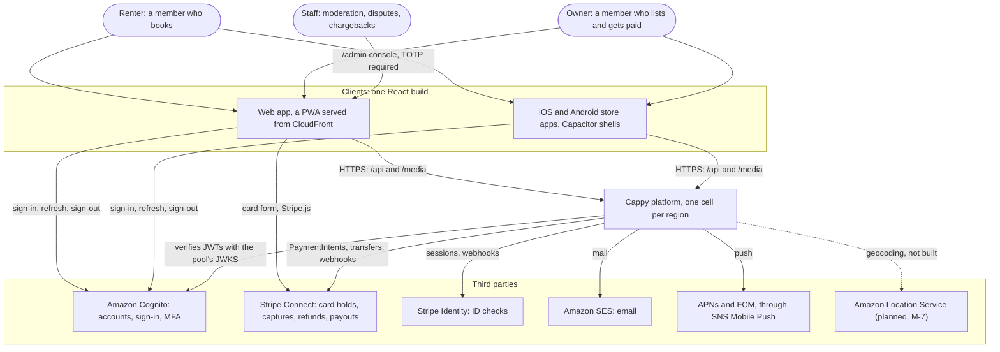

Everyone who books, lists or moderates is a member with a Cognito account.
Product pages need a signed-in member (GOAL 13); only the welcome, sign-in,
legal and help pages are public (`web/src/app/App.tsx:62-67` against
`:161-182`). The web app and the store apps are the same React build
(`web/`, with `web/ios` and `web/android` as Capacitor shells, ADR 0012). The
apps talk to Cognito directly for sign-in (ADR 0002) and to Stripe directly
for the card form, so card details never reach Cappy (ADR 0005). Staff use
the same app under `/admin`. The server checks the `admin` group and, once
deployed, that the account has TOTP MFA.

Where each third party is wired in: Cognito in `infra/platform/identity.tf`
and `cappy_common/auth.py`; Stripe in `payments/provider.py` and
`payments/identity.py`; SES in `notifications/mail.py` and
`infra/platform/email.tf`; push in `notifications/push.py`. Amazon Location
is decided in ADR 0013 §5 but not built; FEATURES §4.3 says what adding it
takes.

---

## 2. Containers and services

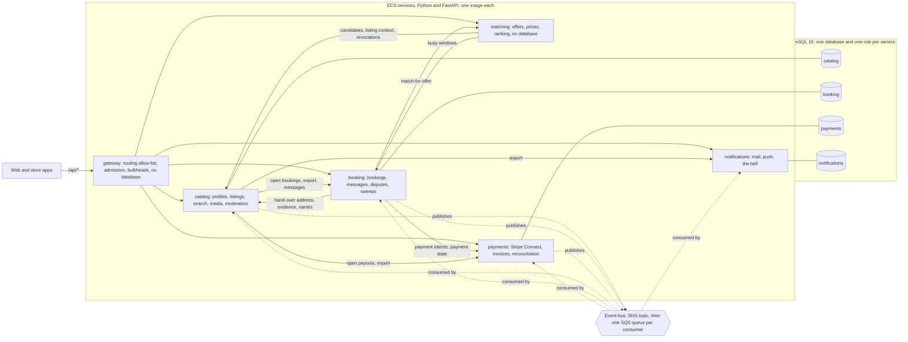

There are six deployables under `backend/services/`, and each builds into one
image (`backend/Dockerfile`, `SERVICE` build argument). They share the
`cappy_common` library (`backend/libs/cappy_common/`), which provides the app
factory, JWT checks, the outbox and consumer, the database runtime, markets
and feature flags.

- **The gateway is a router, not an identity broker.** It forwards
  `/api/<path>` to one service by a first-match allow-list
  (`gateway/routing.py:19-37`) and refuses any path containing `/internal`
  (`:43`). It does not verify tokens (`gateway/settings.py:10`). Every
  service verifies the bearer JWT itself (ADR 0002).
- **Four services own data.** Each has its own database and its own role
  (`infra/platform/data.tf:5`; migrations in
  `cappy_common/migrations.py`). No service reads another's tables.
  Matching and the gateway are stateless.
- **Internal HTTP** (solid arrows between services) goes over `/internal/*`
  routes. Each call carries `X-Internal-Token`, which is the *caller's own*
  token, `<service>:<48 random characters>`. The callee holds only the sha256
  of the tokens of the callers it allows, in `INTERNAL_CALLERS`
  (`cappy_common/auth.py`; `infra/platform/data.tf:160-185`;
  `infra/platform/ecs.tf`). The table below is `local.internal_callers`, and
  every arrow above falls inside it:

| Callee | Who may call it | For what (DATA.md §4) |
|---|---|---|
| catalog | matching, booking | candidates for a search, listing context, revocations; hand-over address, evidence, a renter's name |
| matching | booking | pricing and checking a window for a new booking or an extension |
| booking | matching, catalog | busy windows; open bookings, data export, message authors, DSA stats |
| payments | booking, catalog | PaymentIntents and payment state; open payouts, data export |
| notifications | catalog | data export |

- **Events** (dotted arrows) go through the transactional outbox, as §4
  describes. Catalog, booking and payments publish. All four data services
  consume. Notifications only consumes.
- **Readers.** Catalog and booking also get a reader URL
  (`DATABASE_READ_URL`) for reads that can tolerate replica lag: search,
  listing pages and `/internal/candidates` in catalog, and `/internal/busy`
  in booking (`cappy_common/runtime.py`, DATA.md §1).
- **Background loops** run in every replica and use `SKIP LOCKED`, so
  replicas never repeat each other's work. They cover the outbox relay, the
  SQS consumer and the prune in every data service
  (`cappy_common/runtime.py:132-140`); booking's sweeps every 30 s
  (`booking/jobs.py`); payments' Stripe reconciliation about every 5 minutes
  (`payments/jobs.py`); and catalog's and notifications' hourly jobs.

---

## 3. The request path at the edge

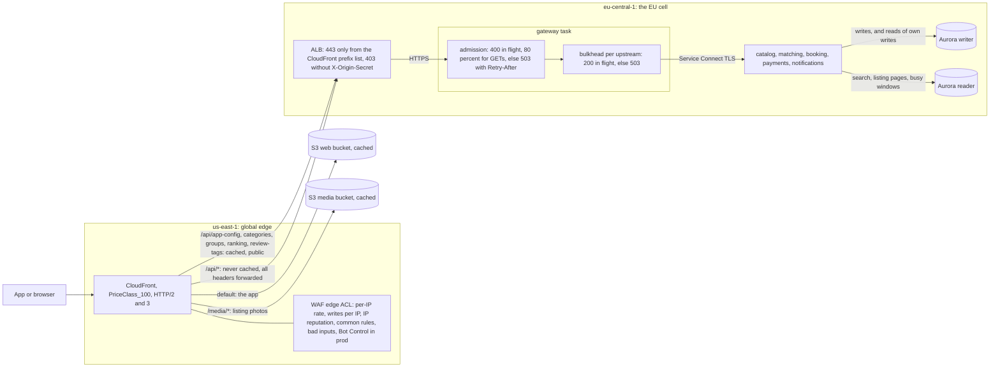

A request passes through the following, in order:

1. **CloudFront and the edge WAF** (`infra/platform/edge.tf`, the
   `aws_cloudfront_distribution.main` and `aws_wafv2_web_acl.edge`
   resources). The WAF blocks above 2,000 requests or 300 POSTs per 5 minutes
   per IP. Stripe's webhooks are exempt from the rate rules and from Bot
   Control, because the endpoint verifies Stripe's signatures instead.
2. **The ALB** accepts 443 only from CloudFront's origin-facing prefix list,
   and forwards only requests that carry the origin secret header. So the WAF
   cannot be bypassed (`edge.tf`, `aws_lb_listener.https` and
   `aws_lb_listener_rule.from_cloudfront`). It speaks HTTPS to the gateway,
   whose certificate is self-signed and made at task start
   (`cappy_common/selfsigned.py`).
3. **The gateway's admission control** (`gateway/main.py:69-95`) caps
   in-flight requests per task at 400. GETs may use only 80 % of that, so a
   flood of searches cannot stop people paying. Past the cap the gateway
   answers `503` with `Retry-After: 2` straight away instead of queueing.
4. **The bulkhead per upstream** (`gateway/main.py:158`, `:178-185`) allows
   200 calls in flight to any one service. A slow matching sheds only
   matching's calls (resilience F3). Timeouts become `504` and unreachable
   upstreams `502`, both with `Retry-After`.
5. **Services** verify the JWT, check the person's revocation (§6.4) and use
   the writer (`Tx`) or the reader (`ReadTx`) (`cappy_common/runtime.py`).

**What is cached where.** Signed-in answers are private, so nothing personal
is cached at the edge. `cappy_common/app.py:166-170` marks every answer to a
request with an `Authorization` header `private, no-store`.

| Path | Cached at CloudFront? | TTL | Why |
|---|---|---|---|
| `/` and hashed assets | yes (`Managed-CachingOptimized`) | assets immutable for a year; `index.html`, `sw.js` no-cache | the web build |
| `/media/*` | yes | immutable (`catalog/media.py:188`) | public listing photos; hand-over evidence lives under `private/`, which CloudFront cannot read (`storage.tf`) |
| `/api/app-config` | yes (`api_public` policy, keyed on the query string only) | 5 min (`gateway/main.py:234`) | version floor, flags, public market facts |
| `/api/categories`, `/groups`, `/ranking`, `/review-tags` | yes (`api_public`) | as the origin says, at most 1 h (`edge.tf:367-383`) | the public vocabulary, served by matching |
| every other `/api/*` | **no** (`Managed-CachingDisabled`) | none | signed in, so `private, no-store` |

---

## 4. Events

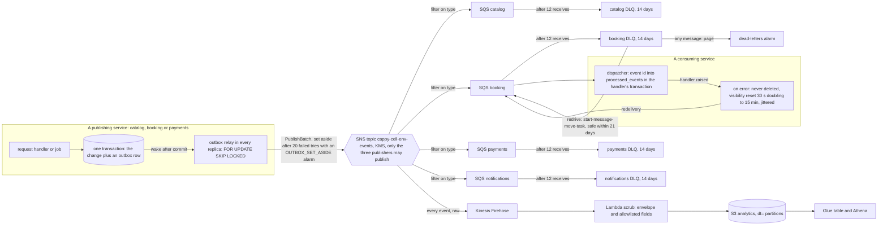

This is ADR 0003. The code is in `cappy_common/events.py` and the
infrastructure in `infra/modules/messaging/main.tf`:

- **Outbox.** `Outbox.add` writes the event in the caller's transaction and
  refuses unknown types. So no event announces a change that rolled back,
  and no committed change goes unannounced. After commit, `Tx` wakes the
  relay, which publishes at once.
- **Delivery is at least once and unordered** (standard SNS and SQS).
  Handlers are written for that. Booking applies only transitions its state
  machine allows from the current status. Payments raises `NotReady` on a
  `completed` that overtakes its capture, so the event is retried.
- **Idempotency.** The dispatcher records the event id in `processed_events`
  in the same transaction as the handler's writes, so a duplicate is a no-op.
  The one exception is notifications: it sends mail before committing, so a
  crash can send a mail twice. Its bell rows have deterministic ids, so a
  repeat never shows twice (`notifications/handlers.py:1-6`).
- **Retries, DLQ and redrive.** The consumer deletes a message only after
  the handler commits. Otherwise the message comes back with jittered
  backoff (`events.py:237`). Each queue has 120 s visibility and 20 s long
  polling, and moves a message to its DLQ after 12 receives, about 2 hours
  in all. That rides out an hour-long Stripe outage (resilience F16). Every
  handler is idempotent, so redriving from the DLQ is safe while the event id
  is still in `processed_events` (21 days; the DLQ keeps messages 14).
- **Queue-age alarms** open a ticket past each queue's SLI: payments 15 min,
  notifications 10 min, catalog and booking 5 min
  (`observability.tf`, `aws_cloudwatch_metric_alarm.queue_age`).
- **Analytics** receives every event through a second, unfiltered
  subscription. A Lambda (`infra/platform/analytics/scrub.py`) strips names,
  emails, notes and staff identities before anything reaches the lake.
- **Revocations everywhere.** Every data service's runtime handles
  `person.signed_out` and `profile.deleted` as well as its own handlers
  (`cappy_common/guard.py`).

**The event matrix** (subscriptions in `infra/platform/data.tf:6-11`; the
same map is copied into `local/bootstrap.py` and `infra/localstack/`, and
`cappy_common/tests/test_subscriptions.py` keeps the copies equal):

| Producer | → catalog | → booking | → payments | → notifications | analytics only |
|---|---|---|---|---|---|
| **catalog** | | `listing.changed`, `moderation.owner_suspended`, `moderation.owner_reinstated`, `profile.deleted`, `person.signed_out` | `profile.deleted`, `person.signed_out` | `profile.deleted`, `person.signed_out`, `moderation.report_received`, `moderation.decision`, `listing.idle` | `profile.created` |
| **booking** | `booking.rated`, `booking.renter_rated`, `booking.owner_reliability`, `moderation.person_flagged`, `staff.action` | | `booking.status_changed` | `booking.status_changed`, `booking.message`, `booking.dispute_offer`, `booking.notice` | |
| **payments** | `payment.payouts_ready`, `payment.identity_verified`, `staff.action` | `payment.authorised`, `payment.failed`, `payment.identity_verified` | | `payment.payout_sent` | `payment.captured`, `payment.refunded` |

Payloads, with the personal data marked, are in DATA.md §3.2.

---

## 5. The booking lifecycle

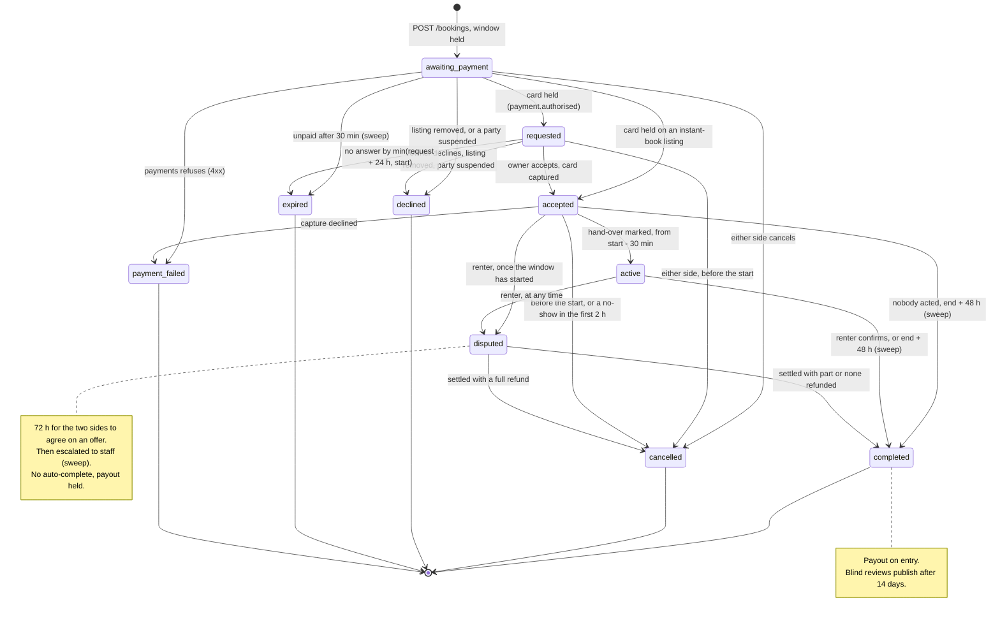

The machine is data, in `booking/booking/state.py`: `TRANSITIONS` holds what
people do and `SYSTEM` what events and sweeps do. The timers come from
`booking/settings.py`:

| Timer | Value when deployed | Setting | Enforced by |
|---|---|---|---|
| Time to pay | 30 min | `payment_timeout_minutes` | expiry sweep (`booking/jobs.py`, `repository.lapsed`) |
| Time for the owner to answer | min(24 h, until the start) | `answer_within_hours` | `booking/handlers.py:36`, expiry sweep |
| Shortest lead time | 2 h | matching `MIN_LEAD_MINUTES` (ADR 0011) | matching offers |
| Earliest hand-over | start - 30 min | `start_early_minutes` | `start` route |
| No-show window | first 2 h of the window | `state.py` docstring | `no-show` route |
| Auto-complete | end + 48 h | `auto_complete_after_hours` | sweep (`repository.finished`) |
| Dispute offers | 72 h, then escalated | `dispute_offer_minutes` | sweep (`support.escalate_due`) |
| Late-return claim | up to 24 h after the end | `late_return_claim_hours` | `late-return` route |
| Blind review window | 14 days | `REVIEW_WINDOW` (`repository.py:113`) | sweep |

The sweeps run every 30 s in every replica, in batches of 100, with `SKIP
LOCKED`. Deployed settings refuse the short local values (`unsafe_reasons`
in `booking/settings.py` and `matching/settings.py`). A booking *holds* its
window in `awaiting_payment`, `requested`, `accepted`, `active`, `completed`
and `disputed` (`state.py`, `HOLDING`). A Postgres exclusion constraint on
those statuses, plus a per-listing transaction lock, makes a double booking
impossible (ADR 0004; booking migration `0003`; `repository.py:234`). A
settlement moves a disputed booking to `cancelled` when the whole price goes
back, and to `completed` otherwise (`booking/support.py:320-326`).

---

## 6. Sequences

### 6.1 Search, request, pay, accept, hand over, complete

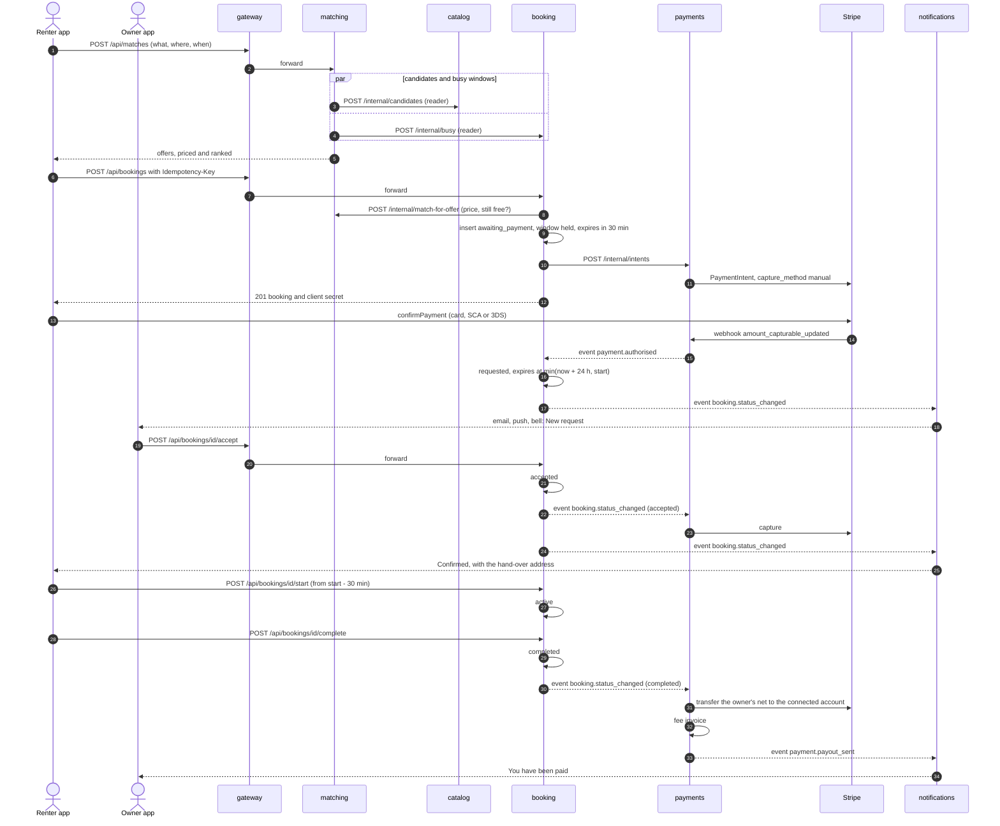

Solid arrows are HTTP. Dashed arrows to a service are events through the
outbox and SNS/SQS. In steps 13 onwards the webhook enters through
CloudFront, the ALB and the gateway, then `payments/routes.py` at
`/webhooks/stripe`. Webhooks are signature-checked and deduplicated by the
Stripe event id. The files involved:

- search: `matching/routes.py:207`, `matching/clients.py`, and
  `catalog/routes.py` `/internal/candidates` (ADR 0001);
- creating a booking: `booking/routes.py:140` (`create_booking`);
- the intent: `payments/routes.py`, with `capture_method: manual` and the
  idempotency key `intent-{booking}` (ADR 0005);
- capture, release, refund and transfer: `payments/handlers.py`
  `on_status_changed` and `pay_out`.

If the renter never taps **complete**, the sweep completes the booking at
end + 48 h. If a webhook is lost, the reconciliation loop finds the intent at
Stripe (`payments/jobs.py`). The owner never sees a booking until the card is
held.

### 6.2 Instant book

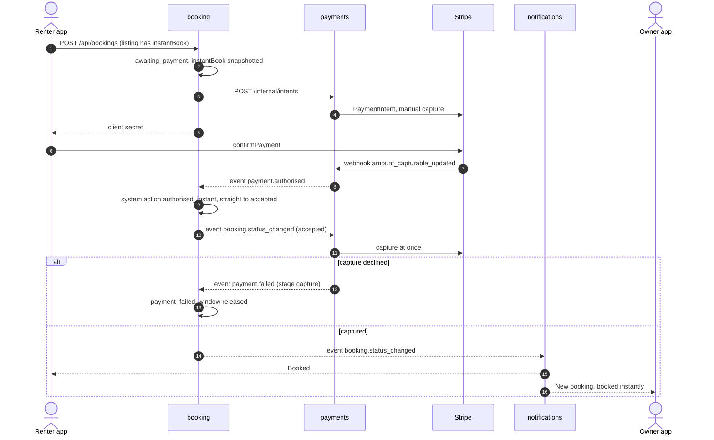

An instant book is the same flow with no owner step: `SYSTEM
["authorised_instant"]` in `booking/state.py` moves `awaiting_payment`
straight to `accepted`, and payments captures on that event as it would
after a manual accept. From here the booking follows §5.

### 6.3 A dispute

```mermaid
sequenceDiagram
  autonumber
  actor R as Renter
  actor O as Owner
  participant B as booking
  participant N as notifications
  participant P as payments
  participant CO as Cognito
  participant C as catalog
  actor ST as Staff

  R->>B: POST /api/bookings/id/dispute (reason)
  B->>B: disputed, dispute row, deadline in 72 h
  B-->>N: event booking.status_changed
  N-->>O: A problem was reported, payout on hold
  O->>B: POST /api/bookings/id/dispute/offer (refundAmount)
  B-->>N: event booking.dispute_offer
  N-->>R: An offer to settle
  alt the other side accepts in time
    R->>B: POST /api/bookings/id/dispute/accept (same amount)
    B->>B: settle
  else no agreement by the deadline
    B->>B: sweep escalate_due
    B-->>N: event booking.notice (dispute_escalated)
    ST->>B: GET /api/admin/bookings/id/case
    B->>CO: AdminGetUser, is TOTP MFA on? (cached 5 min)
    B-->>C: event staff.action (read_case), into the audit log
    ST->>B: POST /api/admin/bookings/id/resolve (outcome, amount, reason, note)
    alt within the staff member's limit for the market
      B->>B: settle
    else above the limit
      B->>B: resolution waits for a second staff member
      ST->>B: POST /api/admin/resolutions/id/approve (a lead)
      B->>B: settle
    end
    B-->>C: event staff.action (resolve or approve)
  end
  Note over B: settle means completed with refundAmount, or cancelled on a full refund
  B-->>P: event booking.status_changed
  P->>P: refund the part, pay out the rest to the owner
  B-->>N: event booking.notice (refunded, partial or owner_paid)
  N-->>R: How it ended
  N-->>O: How it ended
```

Disputes follow ADR 0011 and S-21, and the code is in `booking/support.py`:
`make_offer`, `accept_offer`, `escalate_due`, `resolve`,
`approve_resolution` and `settle`. The refund limits per staff role come
from `markets.json` (`refund_limit_support` and `refund_limit_lead`, through
`market_of_currency`). Four eyes apply above the limit. Notifications skips a
`booking.status_changed` whose `from` is `disputed`, because
`booking.notice` says how the dispute ended (`notifications/handlers.py`).
Every staff read and decision goes to catalog's one audit log as a
`staff.action`. A chargeback is a separate path in payments
(`/admin/payments/...`, FLOWS §8).

### 6.4 Sign-in and sign out everywhere

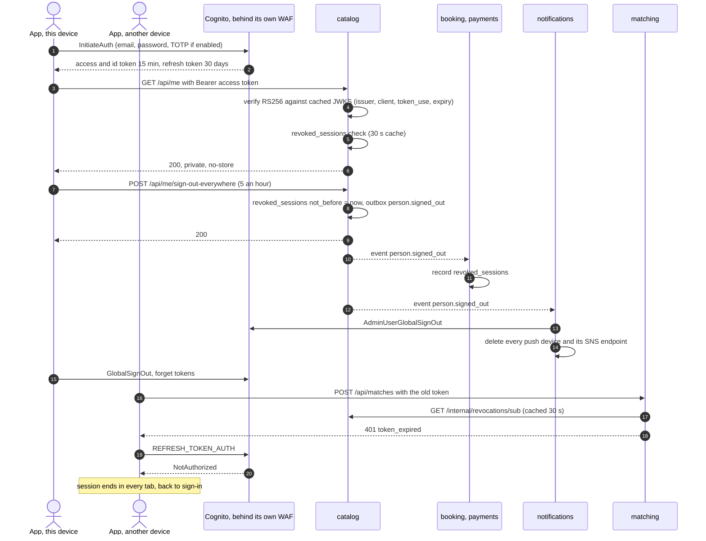

Accounts belong to Cognito, and there is no account service (ADR 0002). The
app keeps access tokens in memory and the refresh token in storage (FLOWS
§3). Tokens last 15 minutes (`identity.tf`, `aws_cognito_user_pool_client.web`).
Revocation adds a per-person "not before" on top, so a stolen token dies
before it expires (P-24):

- catalog writes it (`catalog/routes.py`, `POST /me/sign-out-everywhere`);
- every other data service copies it from the event (`cappy_common/guard.py`);
- matching, which has no database, asks catalog, and answers 5xx rather than
  401 if catalog is down;
- the gateway does not check tokens at all.

The same path runs on account deletion (`profile.deleted`), where
notifications also deletes the Cognito user. The pool's JWKS is fetched at
deploy and given to every task as `AUTH_JWKS_FALLBACK`, so a task that starts
during a Cognito outage still verifies tokens (resilience F5). Locally,
cognito-local has no global sign-out, so another device carries on after a
refresh (INFRA §7, "Known quirks").

---

## 7. AWS infrastructure

```mermaid
flowchart TB
  users["Apps and browsers"]

  subgraph global["us-east-1 and global"]
    cf["CloudFront distribution"]
    wafedge["WAF edge ACL"]
    acmedge["ACM certificate for the domain"]
    r53["Route 53 zone"]
    budgets["AWS Budgets and Cost Anomaly Detection"]
  end

  subgraph cell["eu-central-1: one copy of infra/platform"]
    subgraph vpc["VPC 10.40.0.0/16 across 3 AZs"]
      subgraph pub["Public subnets, one per AZ"]
        alb["ALB, TLS 1.3 policy"]
        nat["NAT gateways: 3 in prod, 1 in staging"]
      end
      subgraph priv["Private subnets, one per AZ"]
        subgraph ecs["ECS Fargate cluster, Service Connect with TLS from a private CA"]
          task["each task: service container plus ADOT collector sidecar"]
        end
        subgraph aurora["Aurora PostgreSQL 16 Serverless v2"]
          writer[("writer")]
          reader[("reader, promotion tier 1")]
        end
      end
      s3ep["S3 gateway endpoint"]
    end

    cognito["Cognito user pool"]
    wafcog["Regional WAF on Cognito"]
    ses["SES domain identity, DKIM, DMARC"]
    sns{{"SNS events topic"}}
    sqs["SQS queue and DLQ per consumer"]
    push["SNS Mobile Push to APNs and FCM"]
    s3web[("S3 web bucket")]
    s3media[("S3 media bucket, versioned")]
    secrets["Secrets Manager: DB URLs, internal tokens, Stripe keys"]
    kms["KMS: Service Connect key, AWS-managed keys"]
    pca["ACM Private CA, short-lived certificates"]
    ecr["ECR repository per service"]
    cw["CloudWatch: logs, alarms, Container Insights"]
    xray["X-Ray"]
    canary["CloudWatch Synthetics canary, every 5 min"]
    topics["SNS alarm topics: alarms pages, tickets"]
    firehose["Kinesis Firehose"]
    scrub["Lambda analytics scrub"]
    s3lake[("S3 analytics")]
    athena["Glue table and Athena"]
    trail["CloudTrail into an object-locked bucket"]
    gd["GuardDuty"]
    sh["Security Hub"]
    backup["AWS Backup, vault under compliance lock"]
  end

  users --> cf
  users -->|"sign-in"| cognito
  cf --- wafedge
  cf --- acmedge
  r53 --> cf
  cf --> s3web
  cf --> s3media
  cf -->|"origin.domain with the secret header"| alb
  alb --> task
  task --> writer
  task --> reader
  writer -.->|"replication"| reader
  task --> sns
  sns --> sqs
  sqs --> task
  sns --> firehose
  firehose --> scrub
  scrub --> s3lake
  s3lake --> athena
  task -->|"through NAT"| cognito
  task --> ses
  task --> push
  task -->|"catalog only"| s3media
  task --> secrets
  task --> xray
  task --> cw
  nat -->|"Stripe, AWS APIs"| internet(("Internet"))
  task --> nat
  task --> s3ep
  cognito --- wafcog
  cognito -->|"codes by email"| ses
  pca --> ecs
  kms --> ecs
  ecr --> ecs
  canary -->|"public URL"| cf
  cw --> topics
  gd -->|"severity 7 and above"| topics
  trail --> cw
  backup --> aurora
  backup --> s3media
  budgets --> topics
```

Each box and the Terraform file that defines it (all under
`infra/platform/`):

| Box | File | Notes |
|---|---|---|
| VPC, subnets, NAT, S3 endpoint | `network.tf` | private subnets `/20`, public `/22`; one NAT per AZ in prod |
| CloudFront, edge WAF, ALB, certificates | `edge.tf` | CloudFront certificate and WAF in us-east-1 through the `aws.us_east_1` provider |
| ECS cluster, services, task definitions, ADOT sidecar, ECR, autoscaling, IAM | `ecs.tf` | the ADOT collector `aws-otel-collector` forwards traces to X-Ray |
| Private CA and KMS key for Service Connect TLS | `tls.tf` | about $50 a month in short-lived mode |
| Aurora, secrets, internal tokens, connection budget check, SNS publish policy | `data.tf` | `rds.force_ssl`, `sslmode=verify-full` |
| SNS topic, SQS queues and DLQs | `infra/modules/messaging/main.tf` | the only part applied (to LocalStack) |
| Cognito pool, app client, groups, Cognito WAF | `identity.tf` | Plus tier and threat protection in prod |
| SES | `email.tf` | bounce and complaint alarms |
| Web and media buckets | `storage.tf` | origin access control; `private/` never through the CDN |
| Firehose, scrub Lambda, Glue, Athena | `analytics.tf`, `analytics/scrub.py` | kept 2 years, Glacier IR after 90 days |
| Alarms, the two severity topics, SLO burn alarms | `observability.tf` | prod plan fails without a pager unless `allow_no_pager` |
| Synthetics canary | `synthetics.tf`, `canary/` | six checks against the public URL |
| CloudTrail, GuardDuty, Security Hub, root-use and IAM-change alarms | `security.tf` | behind `account_security` |
| AWS Backup vault lock, plan, budget, cost anomalies | `backup.tf` | daily kept 35 days, monthly a year in prod |
| State bucket, GitHub OIDC roles | `infra/bootstrap/main.tf` | once per account, by hand |

The only public entry points are CloudFront and the Cognito endpoint, and
each sits behind its own WAF. Tasks and the database have no public
addresses. Every hop inside the VPC uses TLS (P-11). Each service has its own
task role, and only catalog can write media. Only notifications can send mail
or push. Only catalog, booking and payments may publish events (INFRA §4).

---

## 8. Cells and markets

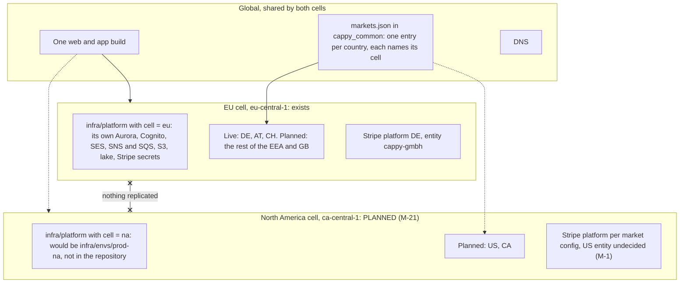

This is ADR 0013. The markets are configuration, not a table:
`backend/libs/cappy_common/cappy_common/markets.json`, validated by
`markets.py`. Each market is a country with its `cell`, `currency`,
`languages`, `units`, `legal_entity`, `stripe_platform`, tax and consumer-law
regime, and its money thresholds in its own currency. Today 34 markets are
listed. Three are `live` (DE, AT, CH), and US and CA carry `cell: "na"`.
Launching a country means setting its status to `live`.

How each thing gets its market, as the code does it today:

| Thing | Its market | Code |
|---|---|---|
| **A person** | the country they give when making their profile (`PUT /me`), which must be a live market; their district must lie in that country | `catalog/routes.py:394` (`live_market`) |
| **A listing** | its owner's market; its currency must be that market's; an out-of-market listing is held by the hourly job | `catalog/routes.py:281-288`, `catalog/jobs.py` (`hold_out_of_market_once`) |
| **A booking** | the listing's currency, snapshotted; limits and time zone come from the market of that currency | `booking/routes.py`, `market_of_currency` in `markets.py` |

ADR 0013 intends a listing to take its market from its geocoded address
(M-7). That needs a geocoder, which does not exist yet.

**Why nothing is replicated between cells.** Each cell keeps its members'
data in its own region: EU data stays in the EU, and Canadian and Québec data
stays in Canada (Law 25). A booking, its payment and its messages always live
in one database and on one Stripe platform. Aurora Global Database or global
tables would copy every row everywhere, which is the opposite of what is
wanted, and would do nothing for the split between Stripe platforms (ADR 0013,
"Rejected"). A person with accounts in both cells has two separate accounts.
Bookings across cells are refused.

**What exists for the NA cell.** Every name carries the cell
(`cappy-<cell>-<env>`, `network.tf:6`, `var.cell` in `eu` or `na`). The
deploy workflow reads `AWS_REGION` and `CELL` from the GitHub environment and
gives a non-EU cell its own state key. Still missing: the env root (M-21),
ECR images in the second region, the app choosing its cell and calling
`https://<cell>.api.<domain>` (M-22), a CSP and a web bundle that know both
Cognito regions, and dashboards per cell (M-45) (INFRA §3).

---

## 9. Delivery

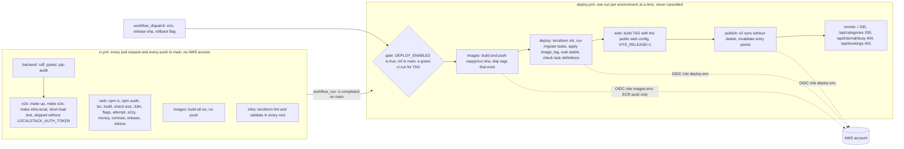

- **Off by default.** The `gate` job runs only when the repository variable
  `DEPLOY_ENABLED` is `true` (`.github/workflows/deploy.yml:54-57`). Until
  the owner sets it, nothing deploys, whatever is merged (GOAL 12).
- **Environments.** A green CI run on `main` deploys to **staging**. **Prod**
  is a manual `workflow_dispatch` naming the release, behind the `prod`
  GitHub environment's required reviewer. The same image sha goes to both.
- **The OIDC roles** (`infra/bootstrap/main.tf:66-112`) trust only
  `refs/heads/main`, only `deploy.yml`, and only their own GitHub
  environment. Sessions last at most an hour. The *images* role can only
  push to ECR, and the jobs that run third-party code (package installs,
  image builds) never hold the *deploy* role (P-2). Pull requests get no AWS
  access at all.
- **Migrations first.** The `deploy` job registers and runs one migrate task
  per database before any service rolls, and stops if one fails. Migrations
  **only expand**: `cappy_common/tests/test_migrations_expand_only.py`
  refuses drops and renames that lack a `# contract:` marker. So old code
  always runs on the newer schema.
- **Automatic rollback.** The ECS deployment circuit breaker, plus
  alarm-based rollback on `api-5xx-rate` and the fast SLO burn during a roll
  (`ecs.tf`).
- **Manual rollback** is `release: <previous sha>` with `rollback: true`.
  Only the images and the web build change. Terraform and the database stay
  at `main`'s head, and no migration runs. The images already exist, so it
  takes minutes (`deploy.yml:39-47`). Hashed web assets are kept 30 days, so
  open tabs survive a release and a rollback.

---

## 10. Scaling

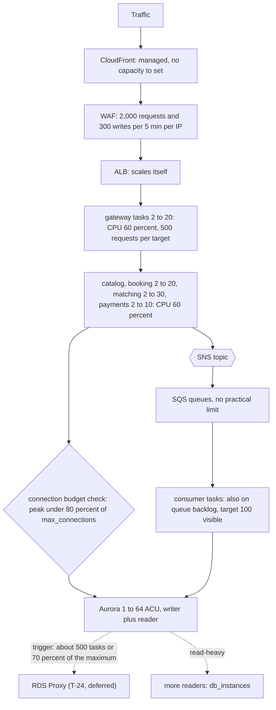

The numbers are prod's (`infra/platform/variables.tf` `scale`,
`infra/envs/prod/main.tf`). Staging runs 1 task per service, up to 2 to 4,
and 0.5 to 4 ACU on one instance.

| Layer | How it scales | Trigger | Limits today | Next step when it runs out |
|---|---|---|---|---|
| **ECS services** | target tracking, per service, between `min` and `max` of `scale` (`ecs.tf:439-495`) | CPU 60 % (out after 30 s, in after 120 s); the gateway also on `ALBRequestCountPerTarget` 500 | 104 tasks in all at the maxima; in-process, the gateway sheds above 400 in flight per task and 200 per upstream | raise `scale` maxima, which the connection budget check must still pass; Graviton for cost |
| **SQS consumers** | the same services also track their queue | `ApproximateNumberOfMessagesVisible`, target 100 (out 60 s, in 300 s) | the task maximum; standard queues have no practical throughput limit; 120 s visibility | more tasks; the queue-age alarm opens a ticket first. The metric is the queue's *total*, not per task; backlog per task (metric math) is the textbook form |
| **Aurora Serverless v2** | ACU between min and max; readers follow the writer (promotion tier 1) | load | prod 1 to 64 ACU, 2 instances; `max_connections` is fixed by the maximum ACU (5,000 at 64) | more readers (`db_instances`); RDS Proxy (T-24) at about 500 tasks or 70 % of the maximum; compare I/O-Optimized past about 32 ACU (INFRA-cost.md) |
| **Connection budget** | a Terraform `check` (`data.tf:195-211`) | every plan | 15 per task (pool 5 + overflow 10), twice for catalog and booking, times the task maxima, times 2 for a deploy at 200 %: prod peak 2,820 against 80 % of 5,000 | fails the plan before it can fail in production; answer with a higher max ACU, lower maxima or RDS Proxy |
| **CloudFront** | managed by AWS | none | PriceClass_100 (Europe and North America edges); caches only the app, photos, the public vocabulary and app-config | nothing to do; photos come as 400, 800 and 1600 px renditions to keep bytes down |
| **Search** | Postgres on the reader: candidates walk districts nearest first, each from its own index, at most 200 districts (`catalog/repository.py:185`), capped | query | benchmark at 100k listings: 15 to 21 ms for candidates at 25 and 500 km, 6 ms for free text (`bench.md`, laptop numbers); free text is `LIKE` on a trigram index, 3 characters minimum | full-text search per language (H-26); points with PostGIS `geography(Point)` and `ST_DWithin` once a market has no districts (M-5, ADR 0013); a `SearchIndex` seam fed by `listing.changed` (F-5, **not built**), then OpenSearch at about a million listings or when multilingual relevance matters (ADR 0001) |
| **Hot listings** | reads go to the Aurora reader | a shared link | signed-in only, so `private, no-store`: no edge cache for a listing (resilience F7) | a per-listing in-process cache (T-07), then more readers |
| **Rate limits** | fixed | per IP or per person | WAF edge 2,000 requests and 300 POSTs per 5 min per IP; Cognito WAF 100 per 5 min per IP; per person: 3 unpaid bookings, 10 requests a day, 100 photos a day, 5 exports a day, 5 sign-outs everywhere an hour | per-user limits in shared state (Redis) at the first abuse signal (resilience F2, `gateway/settings.py:42-44`) |
| **Cost** | follows ACU-hours, tasks, bytes and monthly active users | usage | see below | Cognito Plus is the fastest-growing line |

**Cost, as estimates only.** [`INFRA-cost.md`](INFRA-cost.md) puts prod in
the EU cell at **about $1,550 a month at launch**, for 20,000 monthly active
members and 15 million API requests. Those are approximate Frankfurt list
prices, not a quote. The biggest lines are Aurora ≈ $420, Cognito Plus
≈ $400, Fargate ≈ $240 and NAT ≈ $120, on a fixed floor of about $350. The
budget alarm is set at $4,000. INFRA-cost.md gives no 10× total. Applying
its unit prices to 200,000 members, 150 M requests, 2 TB out of CloudFront
and 500 GB of logs gives the rough extrapolation below. It is **not** in
INFRA-cost.md and is not a quote:

| Line | Launch (INFRA-cost.md) | 10×, back of the envelope | Assumption |
|---|---:|---:|---|
| Cognito Plus | ≈ $400 | ≈ $4,000 | $0.02 per monthly active user |
| Aurora | ≈ $420 | ≈ $1,750 | average 8 ACU per instance instead of 2, plus I/O |
| Fargate | ≈ $240 | ≈ $720 | about three times the minimum tasks on average |
| WAF | ≈ $55 | ≈ $270 | per-request and Bot Control charges × 10 |
| CloudWatch | ≈ $50 | ≈ $330 | 500 GB of logs |
| CloudFront, NAT, SES | ≈ $175 | ≈ $570 | bytes and mails × 10, NAT hours fixed |
| everything else | ≈ $210 | ≈ $360 | the fixed floor, plus growth in GuardDuty, the ALB and S3 |
| **Total** | **≈ $1,550** | **≈ $8,000** | a second cell roughly doubles either figure |

**Load tests, as run** (`TASKS.md` L-1 to L-3, `local/load.py`, run through
`make load`, `make load-spike` and `make load-soak`):

| Test | What ran | Result |
|---|---|---|
| **L-1 closed model** | 50 concurrent browsers for 60 s, plus contested bookings | 20,580 requests, 0 failures; 5 contested windows with exactly 1 winner each; p50 ≈ 100 ms, p95 ≈ 430 ms |
| **L-2 spike** | 30/s → 300/s for 60 s | 16,204 requests, 0 failures, p99 ≈ 220 ms, no shedding needed. At a 1,000/s target the single-process generator peaked near 125/s (0 failures, p99 ≈ 1 s) |
| **L-3 soak** | 20 min at 15/s, open model, 17,542 requests | 0 failures, p99 21 to 38 ms and flat; memory flat per service (±7 MiB); DB connections 21 → 21; every queue and DLQ empty |

These results prove correctness under concurrency: exactly one winner per
contested window (the deadlock found under test is fixed, resilience F12),
no 5xx, and no leak of connections, memory or queue depth over 20 minutes.
They do **not** size production. They ran on a laptop with single-process
containers against local Postgres, not Aurora. The generator saturated
before the stack did, and neither autoscaling nor shedding was exercised.
The breakpoint and hour-long soak on staging, with a distributed generator
(**L-5**), are still pending. So are the mixed open-model journeys (**L-4**).
Until L-5 has run, the task maxima and ACUs are reasoned numbers, not
measured ones. CI runs a short version (`local/load.py 20 30`) in the `e2e`
job.

---

## 11. Failure modes

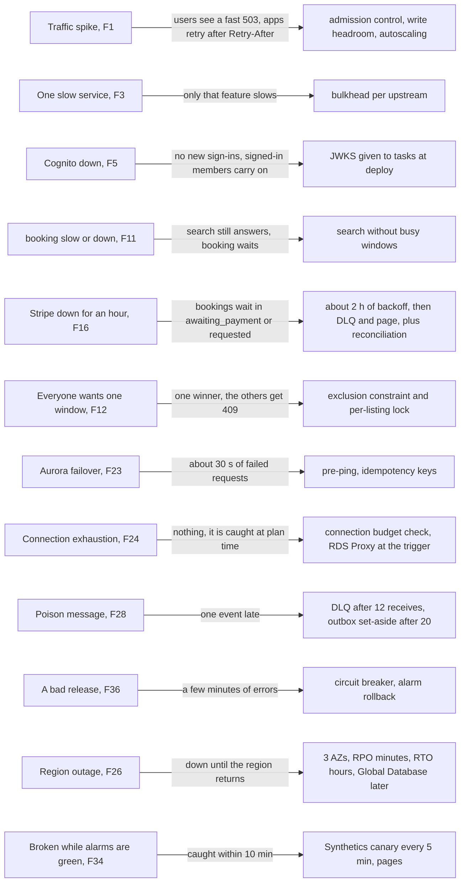

This is a compact form of [`resilience.md`](resilience.md). The labels are
the F numbers there, which also has the status and task behind each one.
Every mitigation above is marked handled there except F26 (region outage),
which is partly handled. The one-region, three-AZ design is a decision, and
the runbook covers the region-loss procedure ("A whole region goes down").
The other partial items are F2 (scrapers: WAF and Bot Control, no per-user
limits yet), F6 (account takeover: Cognito threat protection in prod only)
and F7 (hot listings, §10). How each alarm is first handled is in
[`runbook.md`](runbook.md), "Alarms". The targets behind the burn alarms are
in [`slo.md`](slo.md): browse 99.5 %, book and answer 99.9 %, money within
15 minutes 99.95 %, mail within 10 minutes 99.5 %.

---

## 12. Local development

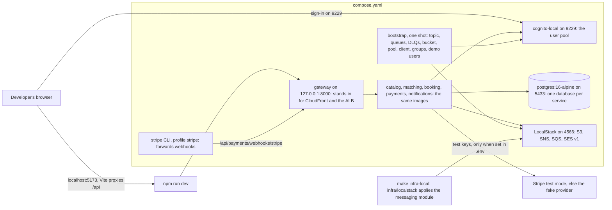

This is ADR 0009. `make up` builds the six images, starts the stack, waits
for health and loads the demo world. The files are `compose.yaml`,
`local/bootstrap.py` and `local/run.sh`, and INFRA §7 has the ports, `make`
targets and quirks.

| AWS | Local | Gap |
|---|---|---|
| CloudFront, WAF, ALB | the gateway on `:8000`, which also serves `web/dist` | no WAF, no edge cache |
| ECS Fargate, Service Connect | the same images under compose, one network | one shared internal token, no `INTERNAL_CALLERS` |
| Aurora PostgreSQL 16 | `postgres:16-alpine`, one database per service (`local/postgres-init.sql`) | no reader; reads go to the writer |
| SNS, SQS, S3, SES | LocalStack Pro (the token in the untracked `.env`) | the licence has no Cognito, ECS, RDS, ELB, CloudFront, WAF, ECR or SES v2 |
| Cognito | `jagregory/cognito-local` | no MFA, no global sign-out, 24 h access tokens, codes in the log (`make codes`) |
| Stripe Connect and Identity | test mode with keys and the `stripe` profile; otherwise the `fake` provider; `stripe-mock` for contract tests (`make test-stripe`) | |
| Timers | local compose shortens lead time (5 min), sweeps (5 s), dispute offers (10 min) | deployed settings refuse these values |

Unit tests need none of this: they use SQLite, an in-memory bus
(`memory://`) and a throwaway JWKS (`make test`). `make test-pg` and
`make e2e` run against the running stack.

---

## 13. How to keep this file true

This is the sixth living doc (`CLAUDE.md`, "Living docs"). It changes **in
the same commit** as any change to what it shows, by whoever makes the
change, agents included. In practice:

- **A new service, database, internal route or caller**: update §2 (the
  diagram and the callers table), and §7 if it needs AWS resources.
- **A new event type or subscription**: update the matrix in §4. The test in
  `test_subscriptions.py` already fails if the four subscription copies
  drift. This page has to be updated by hand.
- **A new booking status, transition or timer**: update §5 from
  `booking/state.py` and `booking/settings.py`, and any sequence in §6 it
  touches.
- **Anything under `infra/`, `compose.yaml` or `.github/workflows/`**:
  update §3, §7, §9, §10 or §12. A priced resource also changes the cost
  lines in §10 and in `INFRA-cost.md`.
- **The NA cell, Amazon Location, the `SearchIndex` seam, RDS Proxy or L-5**:
  when one lands, drop its "planned" or "pending" label and redraw the
  diagram it appears in.
- **Never mark something applied that was only validated** (GOAL 12). When
  L-5 runs, replace the laptop results in §10 with the staging ones.
- Before committing, render every mermaid block, for example with
  `npx @mermaid-js/mermaid-cli`. GitHub renders them too. Plain labels only:
  no HTML and no semicolons, which end a statement in sequence diagrams.
- A change to *why* the system is shaped this way needs a new ADR. This page
  only shows *what* it is.
