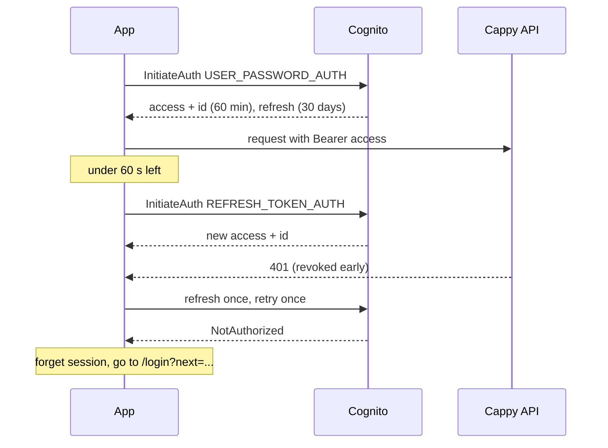
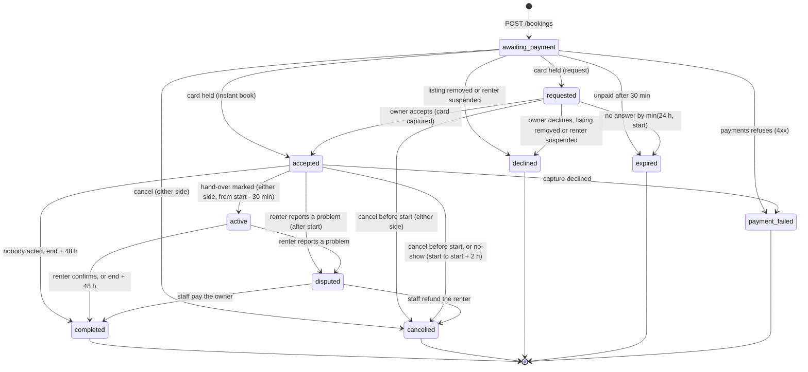
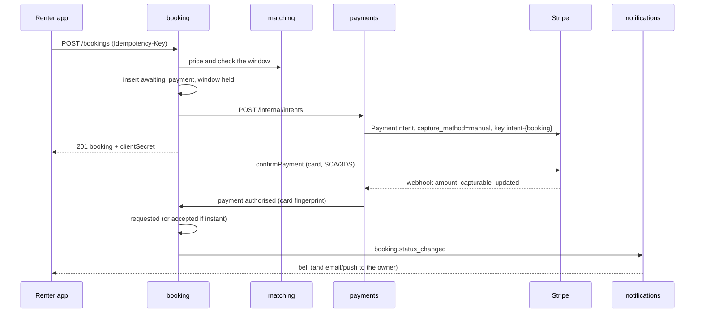
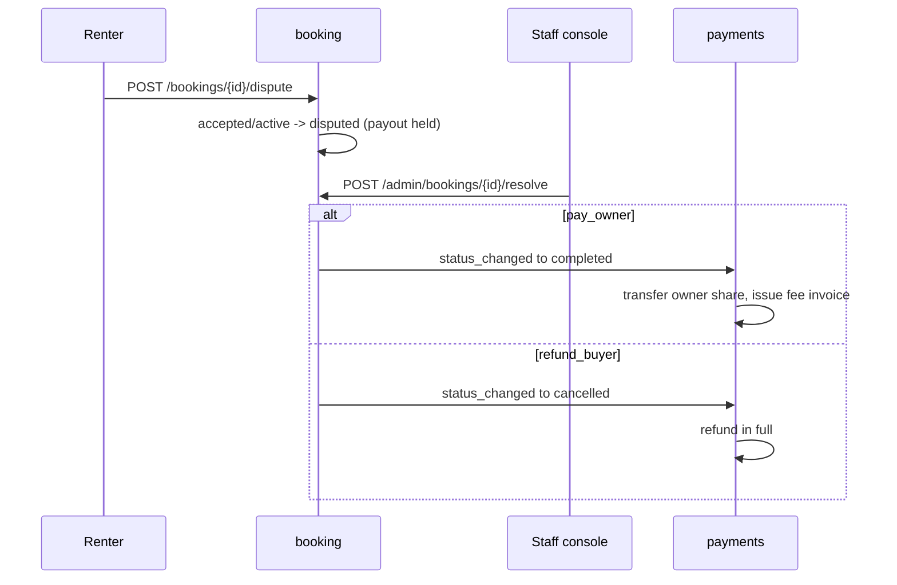

# Cappy flows

How the app works from the user's side today, with the system steps under
each flow. The same React app runs on the web (a PWA) and inside the
Capacitor shells for the App Store and Google Play (ADR 0012). Where the two
behave differently, the flow says so.

This file describes the **committed code**. It was written against commit
`ac716b5` on `prod-readiness`. Numbers come from the code, and each has its
source file next to it. If the code and this file disagree, the code wins, and
this file needs fixing (see the last section).

Conventions:

- API paths are relative to `/api`, which the gateway routes by an allow-list
  (`backend/services/gateway/gateway/routing.py`). Every service checks the
  Cognito access token itself.
- **Event** means an outbox row that is relayed over SNS/SQS (ADR 0003).
  Almost every booking change is one event, `booking.status_changed`, with
  `from`, `to` and `by`.
- **Email** is SES and **push** is SNS Mobile Push (APNs/FCM), both sent by
  the notifications service. The **bell** is the in-app notification centre
  (`/notifications`). What goes where is decided in
  `notifications/handlers.py` and `notifications/prefs.py`, and is covered in
  [Notifications and their settings](#19-notifications-and-their-settings).
- "Renter" and "buyer" both mean the requester. "Owner" means the host.

## Contents

0. [The numbers](#0-the-numbers)
1. [First run and welcome](#1-first-run-and-welcome)
2. [Sign-up and confirmation code](#2-sign-up-and-confirmation-code)
3. [Sign-in, session refresh and sign-out](#3-sign-in-session-refresh-and-sign-out)
4. [Onboarding: profile, 18+, business identity, rent / earn / both](#4-onboarding-profile-18-business-identity-rent--earn--both)
5. [Browse and search](#5-browse-and-search)
6. [The listing page](#6-the-listing-page)
7. [Book: request and instant book](#7-book-request-and-instant-book)
8. [Payment](#8-payment)
9. [The owner accepting or declining](#9-the-owner-accepting-or-declining)
10. [Hand-over, start and complete](#10-hand-over-start-and-complete)
11. [No-show](#11-no-show)
12. [Cancel, withdraw and refund](#12-cancel-withdraw-and-refund)
13. [Dispute and staff resolution](#13-dispute-and-staff-resolution)
14. [Reviews, both sides, blind](#14-reviews-both-sides-blind)
15. [Messaging and masking](#15-messaging-and-masking)
16. [The ID check](#16-the-id-check)
17. [Becoming an owner and creating a listing](#17-becoming-an-owner-and-creating-a-listing)
18. [Payouts and invoices](#18-payouts-and-invoices)
19. [Notifications and their settings](#19-notifications-and-their-settings)
20. [Reporting and moderation (DSA)](#20-reporting-and-moderation-dsa)
21. [Data export and account deletion](#21-data-export-and-account-deletion)
22. [The store apps](#22-the-store-apps)
23. [Known gaps between code, UI and docs](#23-known-gaps-between-code-ui-and-docs)
24. [How to keep this file true](#24-how-to-keep-this-file-true)

The booking lifecycle diagram is in [section 7](#the-booking-lifecycle).

---

## 0. The numbers

| What | Value | Where |
|---|---|---|
| Soonest bookable start | now + 120 min | `matching/settings.py` `min_lead_minutes` |
| Time to pay before the window is released | 30 min | `booking/settings.py` `payment_timeout_minutes` |
| Time the owner has to answer | 24 h, and never past the window's start | `booking/settings.py` `answer_within_hours`, `booking/handlers.py` `answer_deadline` |
| Hand-over can be marked from | 30 min before the start | `booking/settings.py` `start_early_minutes` |
| No-show: renter reports owner | from the start until start + 2 h | `booking/routes.py` `NO_SHOW_REPORTABLE` |
| No-show: owner reports renter | from start + 30 min until start + 2 h | `booking/routes.py` `NO_SHOW_GRACE` |
| Auto-complete (owner paid) | 48 h after the window ends, from `accepted` or `active` | `booking/settings.py` `auto_complete_after_hours` |
| Review window (both sides) | 14 days after the window ends | `booking/repository.py` `REVIEW_WINDOW` |
| Booking sweeps (expire, auto-complete, publish reviews) | every 30 s per replica, jittered | `booking/settings.py` `sweep_seconds` |
| Stripe reconciliation | intents still `created` after 10 min, checked about every 300 s | `payments/jobs.py` |
| Unpaid bookings one person may have at once | 3 | `booking/settings.py` `max_unpaid` |
| Booking requests per person per 24 h | 10 | `booking/settings.py` `max_requests_per_day` |
| ID check needed | booking total above 30 000 cents (EUR 300); no categories | `booking/settings.py` `verify_above_cents`, `verify_categories` |
| Paid cancellation policies | **off**: every cancellation refunds in full | `booking/settings.py` `paid_cancellation_policies` |
| Platform fee | 15 %, inside the total | `matching/domain/pricing.py`, `web/src/domain/pricing.ts` |
| New listings per owner per 24 h | 20 | `catalog/settings.py` `max_listings_per_day` |
| Listing held for a staff check | owner with 0 completed jobs and a rate above 10 000 cents/h (EUR 100) | `catalog/settings.py` `review_above_cents` |
| Photos | 12 per listing, 12 MB each, 100 uploads per person per day | `catalog/routes.py`, `catalog/settings.py` |
| Owner reliability | cancels and no-shows over 12 months, shown after 5 accepted bookings; 3 in 30 days flags the owner to staff | `booking/repository.py` |
| Access and id token | 60 min; the app refreshes 60 s before expiry | `infra/platform/identity.tf`, `web/src/data/auth.ts` |
| Refresh token | 30 days, revocable | `infra/platform/identity.tf` |
| Password | at least 12 characters, nothing else required | `infra/platform/identity.tf`, `Login.tsx` |
| Resend a code | every 30 s | `Login.tsx` |
| Anonymous reports | 3 per email per 24 h; 20 reports per target per 24 h | `catalog/moderation.py` |
| Push devices per person | 10 (newest kept) | `notifications/routes.py` `MAX_DEVICES` |
| Client polling | booking page 2.5 s while `awaiting_payment` or `requested`; booking lists 4 s while one is; messages 5 s; bell 60 s | `web/src/data/repo.ts` |
| App config (forced update) | cached 5 min at the CDN, 10 min in the app | `gateway/main.py`, `repo.ts` |

---

## 1. First run and welcome

**Who and where.** Anyone opening Cappy on a device for the first time, at
`/`. Web and app behave the same.

1. The app restores device flags (`web/src/app/device.ts`: localStorage on the
   web, Capacitor Preferences in the shells) and any stored refresh token.
   Until that is done it renders nothing, so a signed-in person never sees the
   welcome flash (`App.tsx` `Shell`).
2. Signed out, `Gate` decides. On a **first run** (no `welcomeSeen`, no
   `signedInBefore`, and the app was opened at `/`) it redirects to
   `/welcome`.
3. `/welcome` (`Welcome.tsx`) shows what Cappy is, three value points, a
   language switch, and two buttons: **Create an account**
   (`/login?mode=up`) and **I have an account** (`/login`). There are links to
   Impressum, privacy, terms and help. No listings, prices or people are shown
   (GOAL 13). Opening the page sets `welcomeSeen`.
4. After that, a signed-out device skips the welcome and goes to `/login`.
   Once anyone signs in, `signedInBefore` and `welcomeSeen` are both set
   (`auth.ts` `adopt`).

**Edge cases**

- *Deep link while signed out* (for example `/listing/l1` from a shared link
  or an App Link). Any path other than `/` skips the welcome. The person lands
  on `/login?next=/listing/l1` and returns there after signing in.
- *Public pages.* `/welcome`, `/login`, `/legal/*`, `/account/delete` and
  `/help`, `/help/*` render signed out. Every other path redirects.
- *Signed in and opening `/welcome`.* Redirects to `/`.
- *Storage blocked* (private mode). Flags are kept for this visit only, so the
  welcome can show again next time.

---

## 2. Sign-up and confirmation code

**Who and where.** A new person, on `/login?mode=up` (from the welcome or the
Sign in / Create account switch). Web and app are the same; the app talks to
Cognito directly over its JSON API (`web/src/data/auth.ts`).

1. The person enters an email and a password. The form checks the email's
   shape and that the password has at least 12 characters, the same rule as
   the user pool.
2. `SignUp` goes to Cognito with the `email` and `locale` (the app's current
   language) attributes. Cognito emails a six-digit code ("Your Cappy
   verification code is …", sent through SES).
3. The screen switches to **Check your email**. Typing or pasting six digits
   submits by itself. **Send a new code** is enabled after 30 s
   (`ResendConfirmationCode`).
4. `ConfirmSignUp`, then an immediate `InitiateAuth` (`USER_PASSWORD_AUTH`)
   with the password still in memory, and the person is signed in and sent to
   `next` (default `/`).
5. With no Cappy profile yet, the app shows onboarding
   ([section 4](#4-onboarding-profile-18-business-identity-rent--earn--both)).

**Edge cases**

- *Email already registered.* Cognito's `UsernameExistsException` is shown as
  "There is already an account with that email. Sign in instead."
- *Wrong or expired code.* "That code is not right…" or "That code has
  expired. Ask for a new one." (the code's lifetime is Cognito's default).
- *Too many attempts.* "Too many attempts. Wait a few minutes and try again."
- *App closed before confirming.* The password is gone from memory. The next
  sign-in gets `UserNotConfirmedException`, the app resends the code and goes
  back to the code step. Confirming then signs in with the password just
  typed.
- *Offline.* "Cannot reach the sign-in service. Check your connection."
- *Forgot password.* **Forgot your password?** sends `ForgotPassword` and then
  always goes on to the code step, whether or not the address has an account,
  so nobody can probe which emails are registered. `ConfirmForgotPassword`
  with the code and a new password of 12 or more characters signs the person
  in and shows "Password changed".
- *Demo buttons.* Local and staging builds with `VITE_DEMO_ACCOUNTS` show
  "Continue as …". Production builds never set that variable.

---

## 3. Sign-in, session refresh and sign-out

**Who and where.** A member on `/login` (tab **Sign in**), then everywhere.

### Sign-in

1. Email and password go to `InitiateAuth` (`USER_PASSWORD_AUTH`).
2. On success the app keeps the access and id tokens **in memory only**. The
   refresh token is stored in localStorage on the web, or in Capacitor
   Preferences in the shells (mirrored in memory so reads stay synchronous).
3. `adopt` works out the session: `sub`, `email`, and `staff` if the access
   token has the `admin` group. That flag only changes what the UI shows;
   staff calls are checked by the server.
4. `updateLocale` writes the current language to Cognito's `locale`
   attribute, so emails and pushes arrive in that language.
5. The person goes to `next`.

A wrong password shows "That email and password do not match." A Cognito
challenge (for example MFA) shows "This account needs a step this app does not
support yet." The pool has `mfa_configuration = "OPTIONAL"`, but the app gives
no way to turn MFA on.

### Staying signed in

- **Cold start.** If a refresh token is stored, `REFRESH_TOKEN_AUTH` runs
  before the first screen renders.
- **Before every API call** (`repo.ts` `send`), `accessToken()` refreshes if
  the token has less than 60 s left. Concurrent refreshes share one request.
- **A 401 from the API** (a token revoked early) triggers one refresh and one
  retry.
- **The refresh fails for good** (revoked, expired after 30 days, the user
  deleted). The app forgets the session. `Member` gives way to `Gate`, which
  sends the person to `/login?next=<where they were>`. Drafts survive this
  (see below).
- **The refresh fails because the device is offline.** The refresh token is
  kept, and the person is not signed out.

**Drafts that outlive an expired session.** Message drafts and the add or edit
listing form are saved under `cappy.draft.*` in localStorage (`device.ts`
`drafts`). They are cleared only by a deliberate sign-out.

### Other tabs (web only)

Tabs follow the account id under `cappy.who.v1`, never the refresh token
(`auth.ts` `announce`).

- *Another tab signs out.* This tab drops its tokens and shows the sign-in
  screen.
- *Another tab signs in as someone else.* This tab reloads, so no data from
  the old account stays on screen or in the cache.
- *This tab was signed out and another tab signs in.* This tab refreshes from
  the shared refresh token and follows.

The shells have a single web view, so none of this applies there.

### Sign-out (this device)

On the Profile screen, **Sign out** (also on the onboarding screen):

1. In a shell, `DELETE /notifications/devices/{token}`, so this device stops
   getting this person's pushes.
2. Drafts are cleared, the tokens are forgotten, and the query cache is
   cleared (from Profile).
3. Cognito `RevokeToken` revokes this device's refresh token. If that fails
   offline, the token is already gone from the device.
4. The person lands on `/`, which, now signed out, goes to `/login`.

### Sign out everywhere

On the Profile screen, **Sign out everywhere**, then confirm:

1. `POST /me/sign-out-everywhere` (notifications service) calls Cognito
   `AdminUserGlobalSignOut` and deletes **every** push device of the account.
   If this call fails, the device stays signed in and the person sees "Your
   other devices could not be signed out…", so they can try again.
2. Then the same steps as a normal sign-out, with Cognito `GlobalSignOut` in
   place of `RevokeToken`.
3. Other devices stop getting pushes at once. Their access tokens keep working
   for up to 60 min, and the next refresh fails and signs them out.

---

## 4. Onboarding: profile, 18+, business identity, rent / earn / both

**Who and where.** A signed-in person without a Cappy profile. `GET /me`
returns no `owner`, and `Member` then shows `Onboarding` **in place of every
route**. The URL stays as it was, so a deep link opens its screen once the
profile exists. Web and app are the same.

1. **Your name** (at least 2 characters; the server allows 2 to 80).
2. **You are**: a person or a business. A business must give its legal name
   (at least 2 characters) and address (at least 8), and may give a register
   number and a VAT ID (`BusinessFields.tsx`). The server normalises the VAT
   ID and checks it: `DE` plus 9 digits, or another EU country's pattern
   (`catalog/routes.py` `BusinessIn`). Renters see these details on the
   listing and at checkout, because EU consumer law requires it.
3. **Where are you?**: a district from `GET /districts`. Listings live there
   and searches start there.
4. **What brings you to Cappy?**: Renting, Earning or Both (default Both). It
   is kept on the device (`intent`) and only decides where the person lands:
   **Earning** goes to `/earn` once, and the rest stay where they are. Nothing
   is locked by it.
5. **I am 18 or older**, which is required. The client refuses without it,
   and so does the server: `upsert_profile` raises "Cappy is for people aged
   18 or over…" for a new profile without `adult`.
6. Accepting the terms and privacy policy is stated in words next to the
   button ("By continuing you accept the Terms…").
7. `PUT /me` creates the profile, and the catalog publishes `profile.created`.
   The app reloads `/me` and the product appears.

Editing later (Profile, **Edit profile**) uses the same `PUT /me`. It changes
the name, kind, district and business details. The track record is never
touched by an edit.

**Edge cases**

- *Double submit.* `PUT /me` is idempotent (one profile per `sub`).
- *Unknown district.* 422 "unknown district".
- *Sign out* is offered on this screen, for someone who signed in to the wrong
  account.

---

## 5. Browse and search

**Who and where.** Members only, on `/` (the **Explore** tab). The server
agrees: the catalog router depends on `require_principal`. Web and app are
the same. The phone layout has a bottom dock; the desktop has a header.

1. The search starts at the person's home district (`/me.homeDistrict`) until
   they pick another district or city (`CapacityMap`, `DistrictSelect`).
2. **Free in the next 24 hours**:
   `GET /browse/spotlight?district&maxKm&withinHours=24&limit=60` (matching).
   It shows a rail of covers and the same set on the map.
3. **Free text**: `GET /search?q&metro&limit=30` (catalog, trigram index). It
   needs at least 3 characters ("Type at least 3 letters to search.").
4. **What do you need?**: groups and categories. Choosing a category builds a
   *requirement*: hours or a batch quantity, district, radius and the next N
   days. `POST /matches {requirement, sort, limit: 50}` returns bookable
   slots, sorted by best match, cheapest, soonest or nearest. The sort is kept
   in the URL (`?sort=`). The filters sheet changes hours or quantity and the
   radius. The results can be shown as a list or on a map.
5. Matching never offers a start sooner than **now + 120 min**, never the
   person's own listings, and, when deployed, only owners Stripe can pay
   (`REQUIRE_PAYABLE_OWNERS` must be true outside local, per
   `catalog/settings.py`).
6. Tapping a result opens `/listing/{id}`, carrying the chosen slot and start
   in the query string.

**Edge cases**

- *Nothing fits.* "No idle capacity fits that", with **Widen to 90 km** and
  **Allow 3 weeks**.
- *Service down.* "Cappy is not reachable right now", with a retry button.
- *Overload.* The gateway sheds reads first: browsing gets 80 % of in-flight
  capacity and writes keep the rest (`gateway/main.py` `Admission`). A shed
  request gets a 503 with `Retry-After`, and the client never retries sooner
  than that.
- *Offline.* What is cached stays on screen, with the offline bar ([section
  22](#22-the-store-apps)).

---

## 6. The listing page

**Who and where.** Members, on `/listing/{id}`. Web and app are the same. On
the phone, the price and button sit in a bottom bar; on the desktop, in a side
panel.

What the page shows, and the calls behind it:

- The listing, its owner, district, upcoming windows and review summary:
  `GET /listings/{id}`. Reviews: `GET /listings/{id}/reviews?limit=100`.
- **How long / how many**: duration chips between the listing's minimum and
  maximum hours, or batch quantities.
- **Pick a start**: `POST /quote` prices it and says how many hours it takes,
  then `GET /listings/{id}/offers?hours` lists the starts that fit around what
  is already booked. The day comes first, then the time. The page
  pre-selects the slot from the results, else the soonest.
- **Price**: the base, extras, any discount and the total. The 15 % fee is
  inside the total, and the owner's share is shown.
- **The host**: name, verified shield, track record, cancellation rate (if
  there is one), response time, and whether they are a business or a private
  person (consumer rights differ). A business shows its legal identity
  (`TraderNote`).
- **Cancellation policy**: while paid policies are off, every listing shows
  as flexible (`format.ts` `policyInForce` with the flag
  `paidCancellationPolicies`).
- House rules, **Report** (listing and owner), **Block** (owner), and the
  **heart**, which saves the listing (`PUT` or `DELETE /saved/{id}`, retried
  on a blip, shown at once).

**Edge cases**

- *Your own listing.* A banner, "This is your listing", and no book button.
- *Paused, removed, taken down or held listing.* `GET /listings/{id}` returns
  404 and the page shows "not found". The owner too gets 404 while the
  listing is held; see [gaps](#23-known-gaps-between-code-ui-and-docs).
- *Nothing free that long.* An empty state with **Try {min hours}** or a
  smaller batch.
- *Offline.* The **Request** / **Book** button is disabled.

---

## 7. Book: request and instant book

**Who and where.** A member on a listing page. **Request** (or **Book** with
a lightning icon for instant book) opens a confirm sheet. Web and app are the
same.

1. **The confirm sheet** shows when, how long, where, "You pay", "{owner}
   receives", the cancellation policy and the trader's identity. For a
   request it says "Nothing is charged yet: your card is held… {owner} has to
   accept first." For instant book it says "Confirmed as soon as your card is
   held." The final button always reads **Book and pay** (§ 312j BGB).
2. `POST /bookings {requirement, listingId, slotId, start, end}` with an
   `Idempotency-Key` made once per attempt (`Listing.tsx` `attempt`).
3. **Booking** (`booking/routes.py` `create_booking`):
   - refuses if bookings are paused (kill switch `ACCEPTING_BOOKINGS`, 503);
   - replays the first booking if the same key comes again (and refuses the
     key if it was used for a different body);
   - refuses more than 3 unpaid bookings, or more than 10 requests in 24 h
     (429);
   - asks matching to price the window and confirm it is free. The price is
     never taken from the client;
   - refuses your own listing, anyone blocked either way ("this listing is not
     available to you"), and a suspended account;
   - asks for the ID check if the total is above EUR 300 ([section
     16](#16-the-id-check));
   - inserts the booking as `awaiting_payment`, holding the window.
     `expires_at` is now + 30 min. An advisory lock per listing and a Postgres
     exclusion constraint (ADR 0004) make a second overlapping booking fail
     with 409 "that window was just taken; pick another";
   - publishes `booking.status_changed` (`null` to `awaiting_payment`);
   - asks payments for the PaymentIntent ([section 8](#8-payment)).
4. **The app.** With Stripe it shows the card form in the same sheet. With the
   fake provider (local), the card is "authorised" the moment the intent
   exists, and the app goes straight on.
5. **After the card is held**, `payment.authorised` reaches booking:
   - **request**: `awaiting_payment` to `requested`, with `expires_at` =
     min(now + 24 h, window start);
   - **instant book** (the listing's `instantBook`, snapshotted on the
     booking): `awaiting_payment` to `accepted`. Payments then captures at
     once ([section 9](#9-the-owner-accepting-or-declining)).
6. The app shows "Request sent to {owner}" or "Booked", offers push the first
   time ([section 22](#22-the-store-apps)), and opens `/bookings/{id}`. The
   page polls every 2.5 s while the booking is `awaiting_payment` or
   `requested`.
7. **What the other side sees.**
   - Request: the owner gets "New request: {title}. Answer by {deadline}…"
     (email, push, bell), a badge on **Earn** and the request card in the
     Earn inbox.
   - Instant book: the renter gets "Confirmed" and the owner gets "New
     booking: {title} was booked instantly" (email, push, bell). Both emails
     are sent whatever the settings.

The owner can see a booking in their **I'm hosting** list while it is still
`awaiting_payment`, shown as "Authorising payment", but gets no notification
until it is `requested`.

**Edge cases**

- *Double tap or flaky network.* The same `Idempotency-Key` returns the same
  booking and the same PaymentIntent. The button is disabled while sending.
- *The window was just taken.* 409. The app shows the message, reloads the
  starts and makes a new key.
- *Payments refuses for good* (4xx, for example "this owner has not finished
  setting up payments yet"). The booking moves to `payment_failed`, the
  window is free, and the message is shown. The booking stays in the
  renter's list as "Payment failed".
- *Payments down or slow* (5xx or timeout). The booking **stays**
  `awaiting_payment` and the app says "we could not start the payment, and
  you have not been charged; try again". The expiry sweep releases the window
  after 30 min if nobody pays. See
  [gaps](#23-known-gaps-between-code-ui-and-docs): the app makes a new key
  after this error, so the retry cannot reach the first booking.
- *Closing the sheet half way.* The booking stays `awaiting_payment` and can
  be paid from its own page. **Bookings** shows it under "Next up: Finish
  paying so the owner is asked".
- *Suspended account.* 403 "your account is suspended; see the email we sent
  you".
- *Listing taken down or removed before the owner answers.* Booking gets
  `listing.changed` (`removed`) and moves `awaiting_payment` and `requested`
  bookings to `declined`, with the reason "The listing was removed by its
  owner". Payments releases the hold, and the renter gets "Declined… Nothing
  was charged". Accepted bookings stand: the owner still owes them, and the
  hand-over address is still served for a removed listing.
- *Owner suspended.* Their live listings are taken down, which declines
  pending requests as above. When the *renter* is suspended, their own
  pending requests are declined with the reason "The account was suspended".
- *Card seen on a suspended account.* The booking goes ahead, and staff get a
  `linked_to_suspended` notice in the report queue (S-17).
- *Offline.* Every booking button is disabled.

### The booking lifecycle

- A booking **holds** its window in `awaiting_payment`, `requested`,
  `accepted`, `active`, `completed` and `disputed`. Only bookings that never
  happened release it (`state.py` `HOLDING`).
- **Open** bookings, which block account deletion, are `awaiting_payment`,
  `requested`, `accepted`, `active` and `disputed` (`state.py` `OPEN`).
- Every change is one `booking.status_changed` event and one audit row
  (`TransitionRow`). Payments and notifications act on the event.

---

## 8. Payment

**Who and where.** The renter, inside the confirm sheet or on
`/bookings/{id}` while the booking is `awaiting_payment`. Stripe's Payment
Element runs in the web view in the shells too; no in-app purchase is needed
for real-world rentals (ADR 0012).

1. `GET /payments/config` tells the app whether the provider is `stripe` or
   `fake`, plus the publishable key. Stripe.js loads only when someone reaches
   the card step (`@stripe/stripe-js/pure`, no third-party script before
   then).
2. Payments creates the PaymentIntent with `capture_method: manual`,
   `automatic_payment_methods`, `transfer_group` = the booking and
   idempotency key `intent-{bookingId}`, so a retried booking gets the same
   intent. No database connection is held while Stripe answers.
3. The renter enters the card. `confirmPayment` runs with
   `redirect: 'if_required'`. A bank check (SCA/3DS) appears inside Stripe's
   element. Only methods that leave the page return to
   `/bookings/{id}`.
4. The card is **authorised, not charged**. Stripe sends
   `payment_intent.amount_capturable_updated`. The webhook is
   signature-checked and handled once per Stripe event id. Payments marks the
   payment `authorised`, reads the card fingerprint (a fraud signal only) and
   publishes `payment.authorised`.
5. Booking moves the booking on ([section 7](#7-book-request-and-instant-book),
   step 5).
6. **Capture** happens when the booking becomes `accepted` (the owner accepts,
   or instant book). **Release** happens on `declined`, `cancelled`, `expired`
   or `payment_failed` while not captured. **Refund** happens on `cancelled`
   after capture. **Transfer** to the owner happens on `completed`
   (`payments/handlers.py`).

**Edge cases**

- *Card declined at entry.* Stripe's element shows the reason under "Payment
  not authorised". The booking stays `awaiting_payment` and the renter can
  try another card in the same form or later from the booking page
  (`GET /bookings/{id}/payment` returns the same intent). After 30 min the
  booking expires, payments cancels the intent, and nobody is emailed (an
  expiry from `awaiting_payment` notifies no one).
- *3DS abandoned.* The same as a decline: nothing is authorised, and the
  booking lapses after 30 min.
- *The webhook never arrives.* The reconciliation loop looks up intents still
  `created` after 10 min (about every 300 s). If Stripe says
  `requires_capture`, it publishes `payment.authorised`; if `canceled`, it
  marks the payment cancelled.
- *Card-hold expiry.* Not a live risk today. The longest a hold waits for
  capture is 30 min to pay plus at most 24 h for the owner, because capture
  happens at accept, not at the start. Stripe's authorisation window is
  longer than that.
- *Capture declined after accept* (a reversed hold, a closed account).
  Payments publishes `payment.failed` (`stage: capture`). Booking moves
  `accepted` to `payment_failed` and the window is free. Nothing was taken.
  See [gaps](#23-known-gaps-between-code-ui-and-docs): neither side is
  notified.
- *Chargeback* (`charge.dispute.created`). Payments stamps `chargeback_at`
  and logs an error line that the chargeback alarm pages on. A later
  `completed` does **not** pay the owner out; the money waits for a person.
- *Payment result for a booking that already moved on* (cancelled while the
  card was being entered). `system_status` ignores it, and payments voids the
  authorisation when it sees the cancel.
- *Just paid, and the page still shows `awaiting_payment`.* The booking page
  polls every 2.5 s until the webhook lands.

---

## 9. The owner accepting or declining

**Who and where.** The owner. The request card is in the **Earn** inbox, and
the booking page is `/bookings/{id}` (from the email, push, bell or the
**I'm hosting** list). Web and app are the same.

The owner sees the renter's name and renter record ("renter rating"), what
they want and for how long, their own share, the window, when the request was
made, and "Answer {when}, or the request lapses".

### Accept

1. `POST /bookings/{id}/accept`. Only the owner can, only from `requested`,
   and only before `expires_at`.
2. The booking becomes `accepted`, `expires_at` is cleared, and
   `booking.status_changed` goes out. The owner's reliability figures are
   recomputed (`owner.reliability` event).
3. Payments **captures** the card and publishes `payment.captured`.
4. The renter gets "Confirmed: {title}" (email, whatever the settings, plus
   push and bell).
5. Both sides now see **Getting in**: the hand-over address and instructions,
   fetched from the catalog (`SHOWS_HANDOVER` = `accepted`, `active`,
   `completed`, `disputed`). Contact details in messages are unmasked.

### Decline

1. The owner picks a reason from four chips ("Already promised it to
   someone", "Turns out I need it then", "It needs a repair first", "Too short
   notice for me"). The server needs a non-empty reason of up to 500
   characters.
2. `POST /bookings/{id}/decline {reason}`. The booking becomes `declined`.
3. Payments releases the hold.
4. The renter gets "Declined: {title}. Nothing was charged." (email, always)
   and sees the reason on the booking.
5. The Earn sheet says whether the hours go back on the market (the listing
   is live) or not (the listing is paused or removed).

### The owner does not answer

At `expires_at`, which is min(request time + 24 h, window start), the sweep
moves the booking to `expired`. Payments releases the hold, and the renter
gets "Expired: {title}… Nothing was charged." (email, always). The owner gets
nothing. A late tap on Accept gets 409 "this request has lapsed", even before
the sweep has run.

**Edge cases**

- *Double tap on Accept.* The second call gets 409 ("cannot accept a booking
  that is accepted"). Buttons are disabled while busy.
- *Capture declined.* See [section 8](#8-payment).
- *Listing paused while a request waits.* Pausing does not touch pending
  requests; the owner can still accept.
- *Offline.* Accept and Decline are disabled.

---

## 10. Hand-over, start and complete

**Who and where.** Both sides, on `/bookings/{id}` of an `accepted` booking.

### Start (the hand-over)

1. From **30 min before the start** (`canStartFrom`, sent by the server),
   either side can press **I have handed it over** (owner) or **I have
   collected it** (renter). Before that the button reads "Hand-over opens
   {when}".
2. `POST /bookings/{id}/start`. The booking becomes `active`. No
   notification goes out; the other side sees it on the page.
3. The app offers **check-in photos** at once.

### Hand-over photos (evidence)

- Check-in photos can be added while the booking is `accepted` or `active`.
  Check-out photos can be added while it is `active`, `completed` or
  `disputed` (`booking/messages.py`, mirrored in `Evidence.tsx`).
- Each photo is uploaded (`POST /uploads`), then
  `POST /bookings/{id}/evidence {stage, photos (1 to 12), note (up to 1000)}`.
  The catalog confirms the photos are the sender's own uploads and marks them
  kept, so the unused-upload sweep never deletes them.
- Both sides see all evidence. Staff look at it first in a dispute.

### Complete

1. Only the **renter** completes, from `active`: **Mark as handed back**, then
   the sheet "Handed back and all fine?", offering **Yes, it is done**, **Add
   check-out photos first** or **Not yet**.
2. `POST /bookings/{id}/complete`. The booking becomes `completed`.
3. Payments transfers the owner's share ([section 18](#18-payouts-and-invoices)).
   The owner gets "You have been paid {amount}" (email, push, bell).
4. The renter gets "How was {title}?" (email, push, bell), and the rating
   sheet opens at once ([section 14](#14-reviews-both-sides-blind)).

### Auto-complete

48 h after the window ends, the sweep completes any booking still `accepted`
or `active`, and the owner is paid. That covers renters who never press the
button and bookings where nobody marked the hand-over. A **disputed** booking
never auto-completes.

The owner has no button while the booking is `active`; completing is the
renter's word, or the sweep's.

---

## 11. No-show

**Who and where.** Either side, on `/bookings/{id}` of an **accepted**
booking whose hand-over nobody marked (S-11).

| Who reports | About | When | Result |
|---|---|---|---|
| Renter | the owner did not come | from the start until start + 2 h | cancelled, full refund, counts against the owner |
| Owner | the renter did not come | from start + 30 min until start + 2 h | cancelled, **no** refund, the owner is paid their share |

1. **{name} did not show up**, then confirm. The sheet says what happens to
   the money.
2. `POST /bookings/{id}/no-show`. The server checks the window (409 outside
   it, with the exact rule in the message), then sets `no_show` (`owner` or
   `renter`) and `refund_amount` (the full amount, or 0).
3. The booking becomes `cancelled`.
   - Owner missing: payments refunds everything and publishes
     `payment.refunded`.
   - Renter missing: nothing is refunded. The owner's share of what was kept
     is transferred and a fee invoice issued, unless payouts are switched off
     or there is a chargeback, in which case the event waits on its queue.
4. The other side gets the generic "Cancelled: {title}" email (always sent).
   Both see a banner: "Reported: … did not show up".
5. An owner's no-show counts in their reliability rate. Three cancels or
   no-shows in 30 days put them in the staff queue (`reliability` notice).

After 2 h the no-show button disappears. From then on the renter's route is
**Report a problem** (a dispute), and a booking left `accepted` completes by
itself 48 h after the end.

---

## 12. Cancel, withdraw and refund

**Who and where.** Either side, on `/bookings/{id}`. For the renter the
button reads **Withdraw from this booking**, because before the start it is
also their EU right of withdrawal (see `/legal/withdrawal`). For the owner it
reads **Cancel booking**.

**The rules** (`booking/state.py`, `booking/routes.py`,
`booking/cancellation.py`):

- Allowed from `awaiting_payment`, `requested` and `accepted`, by either side.
- **Only before the window starts.** After that the server answers 409 "the
  booked time has started; report a problem instead of cancelling", and the
  renter sees **Report a problem** in place of the button.
- **How much comes back.** Paid policies are off
  (`PAID_CANCELLATION_POLICIES=false`), so every cancellation is treated as
  *flexible*: a full refund. The code for the others is in place for when
  counsel confirms them (G-B2):

  | Policy | Renter cancels | Owner cancels |
  |---|---|---|
  | flexible | full until the start | full |
  | moderate | full until 24 h before, then half | full |
  | strict | full until 7 days before, half until 24 h, then nothing | full |

  Nothing has been charged before the owner accepts, so a cancel then only
  releases the hold.

**Steps**

1. For an `accepted` booking the sheet fetches
   `GET /bookings/{id}/cancellation` (what cancelling now would refund) and
   shows "You get back …".
2. `POST /bookings/{id}/cancel`. The booking becomes `cancelled`, with
   `refund_amount` set.
3. Payments: not yet captured means the hold is cancelled. Captured means a
   refund of `refund_amount` (full or partial) and `payment.refunded`. With a
   partial refund, the owner's share of what was kept is transferred and
   invoiced.
4. The other side gets "Cancelled: {title}" (email always, plus push and
   bell). The window is free again.
5. An owner cancelling an `accepted` booking counts in their reliability rate
   and can flag them to staff.

**Edge cases**

- *Payment still being entered.* Cancelling from `awaiting_payment` voids the
  intent. A late `payment.authorised` is ignored.
- *Double tap.* The second call gets 409 ("cannot cancel a booking that is
  cancelled").
- *Offline.* The button is disabled.

---

## 13. Dispute and staff resolution

**Who and where.** The renter, on `/bookings/{id}`, once the booked time has
started, from `accepted` or `active`: **Report a problem**. The owner cannot
open a dispute. Staff resolve in the console at `/admin`, which only accounts
in the Cognito `admin` group can use; the server checks every call.

1. The renter says what went wrong (1 to 500 characters).
   `POST /bookings/{id}/dispute {reason}`. The server refuses before the
   start ("nothing to report before the booked time; cancel instead").
2. The booking becomes `disputed`. The captured money stays with Cappy: no
   payout, and **no auto-complete**.
3. The renter sees "Under review: … The payment is on hold". The owner sees
   "{renter} reported a problem… Your payout is on hold", but only in the
   app; see [gaps](#23-known-gaps-between-code-ui-and-docs).
4. Staff open the console's **Actions** section, pick **Pay the owner** or
   **Refund the buyer**, and enter the booking id. That calls
   `POST /admin/bookings/{id}/resolve {outcome}`; support tooling can also
   call `POST /internal/bookings/{id}/resolve` (runbook). There is no list of
   disputed bookings in the console yet.
   - `pay_owner`: `disputed` to `completed`. The owner's share is transferred
     and invoiced, the owner gets "You have been paid", and the renter gets
     "How was {title}?".
   - `refund_buyer`: `disputed` to `cancelled`. There is no `refund_amount`,
     so payments refunds in full. The renter gets "Cancelled: {title}"; the
     owner gets no email.
5. The transition is recorded as `by = support:{staff sub}`.

Evidence photos and the message thread are what staff look at. Card
chargebacks are a separate path ([section 8](#8-payment)).

---

## 14. Reviews, both sides, blind

**Who and where.** Both sides of a **completed** booking, on
`/bookings/{id}`. The renter's **Bookings** tab badge counts completed
bookings they have not rated.

- **The renter rates the owner**: on time or late, 1 to 5 stars for the thing
  itself, any of the review tags, and an optional note (400 characters in the
  app; the server keeps 1000). `POST /bookings/{id}/rate` with an
  `Idempotency-Key` per form.
- **The owner rates the renter**: 1 to 5 stars. `POST /bookings/{id}/rate-renter`,
  also with a key. Only owners see renter ratings, as a renter record on
  requests.
- Each side rates **once**, only while the booking is `completed`, and only
  **within 14 days of the window's end** (409 "reviews close 14 days after the
  booked time").

**Blind.** Neither side sees the other's rating until both are in or the
window closes (`to_booking` hides it). Then `publish_reviews`:

- publishes `booking.rated`. The catalog adds the review to the listing (the
  author shown as "Ada L."), dated at the window's end or the rating time,
  whichever came first, and moves the owner's record, which also moves their
  ranking;
- publishes `booking.renter_rated`. The catalog moves the renter's record.

When only one rating came in, the booking sweep publishes it once the 14 days
are over. A redelivered `booking.rated` is counted once (review id
`rv_{booking}`).

---

## 15. Messaging and masking

**Who and where.** Both sides, in **Messages with {name}** on
`/bookings/{id}`. The panel is hidden while the booking is `awaiting_payment`,
and read-only once it is declined, cancelled, expired or `payment_failed`.

1. `POST /bookings/{id}/messages {body}` (1 to 2000 characters) with an
   `Idempotency-Key` per message. `GET` returns the conversation oldest first;
   the app polls every 5 s and on focus.
2. **Masking** (`booking/messages.py`). Until the booking is `accepted`,
   emails (including "bob at gmail dot com"), links and bare domains, phone
   numbers (7 or more digits), messenger handles and IBANs are replaced with
   "[shared once the booking is accepted]". Dates and times are never masked.
   The original is kept, and shown to both sides once the booking is
   `accepted`, `active`, `completed` or `disputed`. If an accepted booking is
   later cancelled, the details hide again. The app draws the placeholder as
   "contact hidden until accepted".
3. **Paying outside Cappy.** A message that asks for it (PayPal, bank
   transfer, cash, "Überweisung"…) is not blocked. It is flagged and logged.
   The sender sees "Keep payments on Cappy…", and the reader sees a warning
   with the advice to report it.
4. The recipient gets a **push** ("New message: {title}") and a bell item.
   Messages are **never emailed**.
5. **Report** is on every message from the other side. **Block** (on the
   booking page or the listing) stops messages and new bookings both ways
   (`PUT /me/blocks/{person}`). The booking itself stands. Unblocking is on
   the Profile screen.
6. Drafts are saved per booking and survive an expired session.

---

## 16. The ID check

**Who and where.** A renter whose booking total is **above EUR 300**. There
are no categories in the list today. It starts from the listing page, when
`POST /bookings` answers 403 `verification_required`. The check is done once
per person.

1. The sheet **Check your ID once** explains it: a photo of an ID document
   and a selfie, checked by Stripe on Cappy's behalf, about two minutes. An
   explicit consent tick is required before it can start (biometric data,
   P-18).
2. `POST /payments/identity/session` starts or continues a Stripe Identity
   VerificationSession. The app opens Stripe's modal
   (`stripe.verifyIdentity(clientSecret)`).
3. The result comes by webhook: `identity.verification_session.verified`, or
   `.requires_input`. On `verified`, payments publishes
   `payment.identity_verified` and booking records the person as verified.
4. The app polls `GET /payments/identity` every 2 s for up to 60 s, then
   retries the **same booking attempt, with the same key**.
5. If Stripe is still processing: "Your ID check is still being processed.
   Try booking again in a few minutes."

With the fake provider (local) the check passes at once. Refusing the consent
means this booking cannot go ahead. An account deletion forgets the
verification.

---

## 17. Becoming an owner and creating a listing

**Who and where.** Any member. Every account can both rent and earn. The way
in is the **Earn** tab (`/earn`; "List your first thing" when empty) or
**List something you own** on the Profile screen. Both lead to `/earn/new`.

1. **Pick a category.** The category fixes the mode: `window` (book hours) or
   `batch` (a quantity, priced by throughput).
2. **The details** (`AddListing.tsx`): title (up to 120 characters), blurb (up
   to 500), district, the **hand-over address** (private until a booking is
   accepted), rate, minimum and maximum hours or throughput and setup, extras,
   up to 12 photos (each shrunk on the device, then `POST /uploads`, which
   re-encodes to WebP), house rules (up to 12), instructions (up to 2000), the
   free windows, **Instant book** and the **cancellation policy**. A
   non-flexible policy is marked as not in force yet.
3. The form is saved as a draft as it is typed, and offers "Your unsaved
   changes are back" with **Discard**.
4. **Publish**: `POST /listings {listing, slots, address}` with an
   `Idempotency-Key` made once per form. The catalog checks: the listings
   kill switch (503), that a profile exists (403), that the account is not
   suspended (403), 20 listings a day (429), every field and number within
   bounds, category and mode matching, a known district, and that every photo
   is the owner's own upload. It then publishes `listing.changed`
   (`created`).
5. The app says "{title} is live", goes to `/earn`, and offers push the first
   time.

### Held listings

If the owner has **no completed jobs** and the rate is **above EUR 100/h**,
the listing is **held**: it exists, but nobody else can see or book it until
staff approve it (`POST /admin/listings/{id}/approve`, which publishes
`listing.changed` `approved`). Raising the price of a listing past that line
before the first completed job holds it again. The owner's Earn card shows
"Waiting for a quick check". Staff see the queue at `GET /admin/listings/held`.
See [gaps](#23-known-gaps-between-code-ui-and-docs): the app still says "is
live", and the console has no approve button.

### Managing listings (Earn)

- **Edit** (`/earn/edit/{id}`): `PUT /listings/{id}`, plus removing and adding
  windows. The mode and category cannot change.
- **Pause / Resume**: `POST /listings/{id}/pause` or `/resume`. A paused
  listing is not offered, and pending requests stay.
- **Remove** (confirmed): `DELETE /listings/{id}` is a soft delete.
  `listing.changed` (`removed`) declines pending requests and releases their
  holds. Confirmed bookings stand.
- **View as a guest** opens the public page.
- The Earn screen also shows idle hours this week and their value, hours sold,
  earned (completed) and "to come" (accepted or active), what is coming up,
  invoices, and the owner's record.

**Payouts must be set up before anyone can pay the owner** ([section 18](#18-payouts-and-invoices)).
Deployed, the catalog hides listings of owners Stripe cannot pay yet.

---

## 18. Payouts and invoices

**Who and where.** Owners, on the **Earn** tab.

### Setting up payouts (Stripe Connect)

1. While Stripe cannot pay the owner, Earn shows **Set up payouts to take
   bookings** (or **Continue setup**).
2. `POST /payments/connect/onboarding` creates the connected account if there
   is none and returns a Stripe-hosted onboarding link. The app navigates to
   it. Cappy never sees identity or bank details.
3. Stripe sends the owner back to `{WEB_BASE_URL}/earn?payments=done` (or
   `?payments=retry`). `/earn` is an App Link path, so in the store apps the
   return opens the app.
4. `GET /payments/connect/status` asks Stripe directly while payouts are not
   enabled, so the result shows without waiting for a webhook. Earn shows
   "Stripe is checking your details" in the meantime.
5. `account.updated` webhooks keep it current. Payments re-reads the account
   from Stripe, because webhooks arrive out of order. When the "can be paid"
   state changes, it publishes `payment.payouts_ready` (with `asOf`) and the
   catalog shows or hides the owner's listings.

Locally, the fake provider makes every owner payable on their first booking.

### Being paid

- **When**: the booking becomes `completed` (the renter confirms, the sweep
  after 48 h, or staff `pay_owner`), or a late cancellation or renter
  no-show leaves money with the owner.
- **What**: a Stripe transfer of the owner's share (`ownerNet`, the total
  less the 15 % fee) against the booking's charge, with idempotency keys from
  the booking. Then `payment.payout_sent`, and the owner gets "You have been
  paid {amount}" (email, push, bell).
- **Held**: the payouts kill switch (`PAYOUTS_ON=false`) leaves the event on
  its queue, retried with backoff, and nothing is lost. A chargeback holds the
  payout for a person. A disputed booking is never paid until resolved.

### Invoices

- For every payout, payments issues an invoice for **Cappy's fee** to the
  owner, once per booking, numbered per year in the issuer's time zone. VAT
  is treated as included, at 19 % German USt by default (`payments/invoices.py`,
  `Issuer`).
- `GET /payments/invoices` lists them on Earn. Tapping one fetches
  `GET /payments/invoices/{number}` (HTML, which needs the token). The web
  opens it in a new tab; the store apps hand it to the share sheet to print,
  save or mail.

---

## 19. Notifications and their settings

**Where.** The bell is `/notifications`. On a phone it is on the **You** tab
with an unread badge; on a desktop, in the header. The settings are on the
Profile screen under **Notifications**.

### What goes out

| Booking change | To | Text key | Email | Push | Bell |
|---|---|---|---|---|---|
| to `requested` | owner | "New request: … Answer by {deadline}" | per setting | per setting | yes |
| to `accepted` | renter | "Confirmed: …" | **always** | per setting | yes |
| instant book (`awaiting_payment` to `accepted`) | owner | "New booking: … booked instantly" | **always** | per setting | yes |
| to `declined` | renter | "Declined: … Nothing was charged." | **always** | per setting | yes |
| to `cancelled` | the side that did not cancel (the renter when staff or the system did) | "Cancelled: …" | **always** | per setting | yes |
| to `expired` from `requested` | renter | "Expired: … Nothing was charged." | **always** | per setting | yes |
| to `completed` | renter | "How was …? Rate it" | per setting | per setting | yes |
| payout sent | owner | "You have been paid {amount}" | per setting | per setting | yes |
| new message | recipient | "New message: …" | **never** | per setting | yes |
| report received | reporter | "We received your report" | always | never | yes, if signed in |
| moderation decision | person affected, reporter | statement of reasons / outcome | always | never | yes, if signed in |

Nothing goes out for `active`, `disputed`, `payment_failed` or an expiry from
`awaiting_payment`.

- **Language**: each person's Cognito `locale` (English, or German for any
  `de…`). The bell re-renders each item in the language it is read in.
- **Times** in emails are told in Europe/Berlin (`texts.py`
  `DEFAULT_TIME_ZONE`), because listings carry no time zone yet.
- **Emails** only go to a verified address.
- **Pushes** go to every registered device of the person. A device that has
  gone is forgotten.
- Delivery is at least once. A crash after sending can send the same email
  twice, but never loses one. Bell items are keyed by event, person and text,
  so they are kept once.

### Settings

`GET` / `PUT /notifications/settings`: push and email for each of Bookings and
requests, Messages, Payouts, and News and offers. Marketing is off by
default; Cappy sends none. The toggles are saved as they are flipped, and roll
back on an error. The bell always gets everything. The emails marked
**always** above go out whatever the setting: they are the durable record of
a contract or of money (§ 312f BGB), or the law requires them (DSA).

### The bell

`GET /notifications` shows the newest first, in the app's language
(`Accept-Language`), with an unread count. The app polls every 60 s and on
focus. Opening the screen marks what is on it read after 1.5 s; **Mark all as
read** is also there. Tapping an item opens its screen inside the app. Links
that point off the app are never followed.

### In the store apps

On a phone the Profile screen also shows whether push is on. If it is off,
iOS gets **Turn on in Settings**, which opens the app's own page in Settings,
and Android gets the path to follow by hand. If the app has not asked yet,
there is **Turn on notifications**. The timing of the first ask is in
[section 22](#22-the-store-apps).

---

## 20. Reporting and moderation (DSA)

**Who and where.** Any member can report a **listing** (on its page), a
**person** (the owner card, or the other party on a booking), a **message**
(on each message) or a **review**. The server also takes anonymous reports,
with an email so the reporter can hear back (DSA Art. 16).

### Reporting

1. **Report** opens a sheet: a reason (illegal, fraud, unsafe, counterfeit,
   spam, offensive, privacy, other), details of at least 10 characters, an
   email when signed out, and the **good-faith statement**, which is required
   (Art. 16(2)(d)).
2. `POST /reports`. Signed in, the reporter hears back at their own verified
   address, never one they type. Limits: 3 reports a day per anonymous email,
   20 a day about any one target.
3. The report is stored as `open`, and `moderation.report_received` goes out.
   The reporter gets "We received your report", with the reference (email,
   plus the bell if signed in). The sheet shows the reference too.

### Staff decide (`/admin`)

1. **The queue**: `GET /admin/reports?status=open`, oldest first. It also
   holds notices the system raised: `reliability` (an owner with 3 cancels or
   no-shows in 30 days) and `linked_to_suspended` (a card a suspended account
   used). There is one open notice per person and reason.
2. **Decide**: `POST /admin/reports/{id}/decide {action, statement (at least
   20 characters), ground (law or terms), clause, automated}`.
   - `dismiss`: nobody is restricted. The reporter gets "we found no breach".
   - `take_down` (listings only): the listing is hidden (`moderated_at`),
     `listing.changed` (`removed`) declines its pending requests, and the CDN
     is purged.
   - `suspend`: the owner is marked suspended, all their live listings are
     taken down, and `moderation.owner_suspended` goes out. Booking then
     refuses their new bookings and declines their own pending requests; the
     catalog refuses their new listings.
3. **The statement of reasons** (Art. 17): the person affected gets "We
   removed your listing" or "We suspended your account", with the facts, the
   ground, whether it was automated, and how to contest it (reply within
   6 months, out-of-court settlement under Art. 21, or the courts). The
   reporter gets the outcome (Art. 16(5)).
4. **Direct actions** without a report: take down a listing, suspend or
   reinstate an owner, and resolve a dispute. A reinstated owner can list and
   book again, but their listings stay down.
5. Everything is written to the audit log (`GET /admin/audit`). The DSA
   transparency figures for a month come from `GET /admin/dsa-stats?month=`.

**While suspended**: accepted bookings stand on both sides (the owner still
owes them), sign-in still works, and messages still work.

**Signed out**: `/legal/report` explains reporting, but no report form is
reachable without signing in; see [gaps](#23-known-gaps-between-code-ui-and-docs).

---

## 21. Data export and account deletion

**Who and where.** Any member, on the Profile screen under **Your data**. The
public page `/account/delete` explains the steps for Google Play and for
people who cannot sign in.

### Download my data (GDPR Art. 15/20)

1. `GET /me/export`. The catalog gathers its own data (profile, listings,
   saved listings, reviews written, uploads), then asks booking (bookings,
   messages sent with the original unmasked text, evidence), payments (payout
   link, ID-check status, invoices, payments; never card details) and
   notifications (bell items and settings). It returns one JSON file,
   `cappy-my-data.json`.
2. The web downloads the file (or uses the share sheet on phones that cannot
   save a download). The store apps write it to the cache and open the share
   sheet.

### Delete account

1. **Delete account** opens a sheet explaining what goes and what is kept.
2. `DELETE /me`. The catalog asks booking for **open bookings** (see
   [section 7](#the-booking-lifecycle)) and payments for **pending payouts**
   (captured money not yet paid out to this person). If there are any, it
   answers 409 `open_obligations` with the counts and `until`, the end of the
   last open window. The sheet shows "finish or cancel your open bookings, and
   wait for your payouts, before deleting your account. You can delete your
   account from {date}."
3. Otherwise the catalog **forgets** the person: listings are soft-deleted and
   their addresses wiped, saved listings and the payable flag removed, the
   profile becomes an anonymous "Former member", and reviews they wrote are
   re-signed "Former member". It then publishes `profile.deleted`, which
   leads to:
   - booking: blocks and the verified flag deleted, and their messages
     replaced with "[removed: the account was deleted]". Bookings stay as
     financial records;
   - payments: the payout link and the ID-check record deleted. The Stripe
     account itself stays with Stripe;
   - notifications: devices, bell items and settings deleted.
4. The app then calls Cognito `DeleteUser` with the access token, which
   deletes the sign-in, clears the cache and shows "Your account is deleted".

**Edge cases**

- *Open bookings, on either side, including `disputed`.* Refused, as in
  step 2. The person has to finish, cancel or wait.
- *Cognito deletion fails after step 3.* "Your sign-in could not be deleted.
  Try again." The platform data is already gone. See
  [gaps](#23-known-gaps-between-code-ui-and-docs).
- *Session expired.* "Sign in again to delete your account."

---

## 22. The store apps

The iOS and Android apps are Capacitor shells around the same build
(`web/capacitor.config.ts`, app id `app.cappy`). They call the public API at
`VITE_API_URL`. Media paths are resolved against the API's origin.

### Welcome and sign-in

These work as on the web ([sections 1 to 3](#1-first-run-and-welcome)). The
refresh token and device flags are kept in Capacitor Preferences (the
platform's app storage), because iOS can purge a web view's localStorage.

### Push permission timing (U-4)

- The OS is **never asked at sign-in**. After sign-in the app only
  re-registers if permission was already granted
  (`enablePush(accessToken)` in `Member`).
- The first moment it asks is right after the **first booking request** or the
  **first published listing**. `PushPrime` shows a sheet first ("Get told when
  it matters"), then **Turn on notifications** or **Not now**. It is asked
  once per device (`pushAsked`), and only if the OS would still ask.
- Once granted, `PushNotifications.register()` returns the APNs or FCM token,
  and the app sends `POST /notifications/devices {platform, token}`. The
  server creates an SNS platform endpoint. A token moves to whoever signed in
  on that device last, and at most 10 devices are kept per person.
- Sign-out removes this device's token (`DELETE /notifications/devices/{token}`).
  Sign out everywhere removes all of them.
- The Profile screen shows the permission state and a way to turn it on
  ([section 19](#19-notifications-and-their-settings)).

### Deep links

- **Universal Links (iOS) and App Links (Android)** for `/listing/*`,
  `/bookings/*` and `/earn*`. The web build writes
  `/.well-known/apple-app-site-association` and `/.well-known/assetlinks.json`
  from `VITE_APPLE_TEAM_ID` and `VITE_ANDROID_SHA256`. Unset, they carry
  placeholders and verify nothing. The Android intent filter uses
  `${appLinkHost}`; the iOS entitlement still says `applinks:cappy.example`.
- An opened link (`appUrlOpen`) or a tapped push (`data.link`) is turned into
  an in-app path and routed like a tap.
- Signed out, a deep link goes to `/login?next=<path>` and returns there
  after sign-in. It never shows the welcome.

### The Android back button (U-5)

In order: close the top sheet, if one is open (`sheets.ts`); else go back one
screen, if there is history and this is not `/`; else minimise the app (not
kill it), as native apps do.

### Offline (U-11)

- A bar above the dock: "You are offline. What you see may be out of date;
  paying, booking and sending wait until you are back." This is the same on
  the web.
- What is cached stays readable. Every button that moves money or sends
  something is disabled while offline: book, pay, accept, decline, start,
  complete, cancel, dispute, no-show, send, rate and block.
- The service worker (web) caches the app shell only, never the API.
- API calls that fail on the network say "Cannot reach Cappy. Check your
  connection and try again." Reads retry twice with backoff; 4xx answers are
  never retried.
- A cold start offline keeps the stored refresh token, but the app shows the
  sign-in screen until it can reach Cognito; see
  [gaps](#23-known-gaps-between-code-ui-and-docs).

### Forced update

At start the app reads `GET /app-config` (`minVersion`, `latestVersion`,
`flags`, `rollouts`). Every API call carries `X-App-Version`. A **store
build** below `minVersion` shows only **Update Cappy** ("This version of the
app is too old to talk to Cappy safely…") and a link to its own store
(`VITE_APP_STORE_URL` / `VITE_PLAY_STORE_URL`). The web is always the current
build and is never gated. An older backend without `/app-config` does not
block the app. `latestVersion` is read but nothing shows a soft "update
available" today.

### Other differences from the web

- **Data export and invoices** go to the share sheet: there are no downloads
  or tabs in a shell.
- **Stripe payouts onboarding** leaves the app for Stripe, and comes back
  through the `/earn` App Link.
- **Camera and photos**: the iOS usage strings cover listing and hand-over
  photos.
- **Crash reports** from both go to `POST /client-errors`: the message, stack,
  route, version and platform, and nothing that identifies the person.

---

## 23. Known gaps between code, UI and docs

Found while writing this file. Each is a place where the code, the UI and the
docs say different things. They are listed so they are not mistaken for
intended behaviour.

1. **A retry after a payments outage makes a second booking.**
   `Listing.tsx:209` makes a new `Idempotency-Key` after *any* error,
   including the 503 that `booking/routes.py` `_with_payment` returns while
   keeping the booking `awaiting_payment`. ADR 0011 relies on "a retry with the
   same key gets the same intent". The new attempt instead meets the
   person's own held window and gets 409 "that window was just taken" until
   the first booking lapses 30 min later.
2. **Nobody is told about `payment_failed`, `disputed` or `active`.**
   `notifications/handlers.py:61` (`messages`) has no entry for them. The
   capture-declined comment in `payments/handlers.py` and ADR 0011 say both
   sides are told of a failed capture; neither is. An owner whose booking is
   disputed learns of it only by opening the app.
3. **The Messages email toggle does nothing.** Messages are never emailed
   (`notifications/handlers.py:76` `chat_push`, delivered with
   `email=False`), but Profile offers an email checkbox for them
   (`Profile.tsx:569`). Its fallback text says "Everything also arrives by
   email" (`Profile.tsx:583`).
4. **A held listing is announced as live.** `AddListing.tsx:453` toasts
   "{title} is live" whatever the server's `held` says, and an edit that
   holds the listing (`catalog/routes.py` `update_listing`) is not mentioned
   at all.
5. **Held listings cannot be approved from the console.** The endpoint exists
   (`POST /admin/listings/{id}/approve`, `catalog/moderation.py`), but neither
   `repo.ts` nor `Admin.tsx` calls it or lists `/admin/listings/held`.
6. **The owner of a held listing gets 404 on its page.** `catalog/routes.py:410`
   `listing_detail` reads the row without `include_held`, so **View as a
   guest** on Earn shows "not found".
7. **Suspending from a message or review report fails.** `Admin.tsx:224`
   offers **Suspend the owner** for every non-listing report, but
   `_affected_owner` (`catalog/moderation.py:315`) returns `None` for
   messages and reviews, so the server answers 422 "this report does not
   point at an owner". There is also no action that removes a reported
   message or review.
8. **"Refunded" shown when nothing was charged.** `cancellation.py`
   `refund_amount` returns the full amount when `charged` is false, so a
   request cancelled before acceptance shows "{amount} is refunded to the
   card" (`BookingDetail.tsx:392`), when in fact only a hold was released.
9. **The removal reason blames the owner when moderation did it.**
   `booking/handlers.py:92` declines pending requests with "The listing was
   removed by its owner", including listings taken down by staff.
10. **No report form for signed-out people.** GOAL 13 lists "the report form
    (DSA Art. 16)" as public, and `/legal/report` (`Legal.tsx:381`) says "You
    do not need an account". The server accepts anonymous reports, but the
    only Report buttons are on screens that require sign-in.
11. **Deleting the account can loop into onboarding.** If Cognito `DeleteUser`
    fails after `DELETE /me` (`Profile.tsx`, `DeleteAccount`), the next
    sign-in finds no profile. Onboarding's `PUT /me` updates the anonymised
    row but never clears `deleted_at` (`catalog/repository.py`
    `upsert_profile`), so `find_owner` keeps returning nothing and onboarding
    shows again.
12. **Photos of a deleted account are not deleted.** The delete sheet says
    "Your sign-in, profile, saved listings and photos are deleted"
    (`Profile.tsx:397`). `CatalogRepository.forget` deletes no media, and the
    orphan sweep (`catalog/jobs.py`) only removes uploads never used on a
    listing.
13. **Push is not re-registered for the next account on the same device.**
    `native.ts:91` returns early once `registered` is set. After a sign-out
    (which deletes the token server side) and a sign-in as someone else
    without restarting the app, the new account's device is never
    registered.
14. **Offline at cold start shows the sign-in screen.** `auth.ts` keeps the
    refresh token when offline, but `session` stays null, so the person sees
    `/login` until they reload online. Nothing retries when the network comes
    back.
15. **The owner sees unpaid bookings.** `booking/routes.py` says "The owner
    only sees the request once the card is authorised", but
    `GET /bookings?role=owner` returns `awaiting_payment` (and later
    `payment_failed`) bookings, and **I'm hosting** lists them.
16. **The pay form can show again right after paying.** Between Stripe
    confirming and the webhook landing, `BookingDetail.tsx:151` (`payNow`)
    still sees `awaiting_payment` and renders the Payment Element for an
    intent that is already authorised.
17. **"24 hours to answer" is not always true.** The deadline is capped at the
    window's start (`booking/handlers.py` `answer_deadline`), but
    `PushPrime.tsx:61-62` promises 24 hours.
18. **Server and client disagree on closed conversations.** The app hides the
    composer for declined, cancelled, expired and `payment_failed` bookings,
    and hides the whole thread while `awaiting_payment`
    (`Conversation.tsx:129`, `BookingDetail.tsx`). The server's
    `POST /bookings/{id}/messages` (`booking/messages.py:122`) accepts a
    message in any status.
19. **One market in the code.** Bookings are always `currency="eur"`
    (`booking/routes.py:180`), the app formats everything as euros
    (`formatEur`), email times are Berlin time, the business VAT check only
    knows EU formats, and the report sheet says "call 112"
    (`Report.tsx:144`). GOAL 16 names the US and Canada, where 112 is not the
    emergency number.
20. **Redirect payment methods in the shells may not come back.**
    `PayStep.tsx` sets `return_url` to `location.origin`, which is
    `capacitor://localhost` or `https://localhost` inside a shell. This is
    unverified. It matters only for payment methods that leave the page,
    which `automatic_payment_methods` can enable.
21. **ADR 0012 is out of date on two points.** It says the refresh token lives
    in the shell's web storage (the code uses Capacitor Preferences) and that
    notifications are email only (push is built).
22. **Placeholders that block a store release.** The iOS entitlement is
    `applinks:cappy.example` with `aps-environment` `development`
    (`web/ios/App/App/App.entitlements`).

---

## 24. How to keep this file true

This is one of the living docs in `CLAUDE.md` ("Living docs: keep them
true"). It describes the system as it is now, and **any change that alters a
flow updates this file in the same commit**: a new state or transition, a
timer or limit, a new screen, button or route, a changed notification, email
or push, or a web or app difference. Builders and agents included.

- Take the numbers from the code and name the file. Do not copy them from
  another doc.
- When you fix an item in [section 23](#23-known-gaps-between-code-ui-and-docs),
  delete it and describe the new behaviour in its flow.
- A flow that changes *why* the system is built a certain way also needs a new
  ADR (`docs/adr/`), not only an edit here.
- The companion docs are `docs/FEATURES.md` (what exists and its provider
  seams), `docs/INFRA.md` (resources and switches) and `docs/DATA.md`
  (tables, events and personal data). Keep them consistent with this file.
